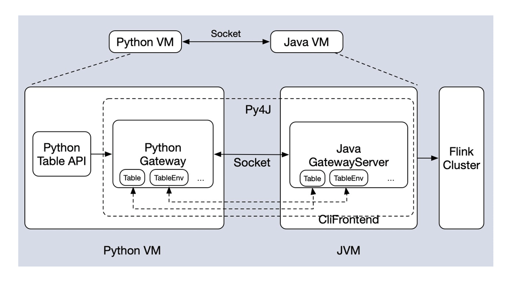

## 参考文章
http://www.uml.org.cn/sjjmck/202007201.asp?artid=23512
https://tech.meituan.com/2018/10/18/meishi-data-flink.html
https://mp.weixin.qq.com/s/e8lsGyl8oVtfg6HhXyIe4A
https://developer.aliyun.com/article/750241
https://segmentfault.com/a/1190000019544612?utm_source=sf-related

https://zhuanlan.51cto.com/art/202004/614030.htm
https://zhuanlan.51cto.com/art/202004/614133.htm
https://zhuanlan.zhihu.com/p/166502285

[PyFlink 架构、应用案例及未来规划](https://www.bilibili.com/video/BV1W7411o7Tj?from=search&seid=17905906308625918099)

[PyFlink 核心功能介绍](https://www.cnblogs.com/xiexiandong/p/12878642.html)
Python虚拟机运行过程概述

1. python先把代码(.py文件)编译成字节码，交给字节码虚拟机，然后虚拟机会从编译得到的PyCodeObject对象中一条一条执行字节码指令，并在当前的上下文环境中执行这条字节码指令，从而完成程序的执行。Python虚拟机实际上是在模拟操作中执行文件的过程。PyCodeObject对象中包含了字节码指令以及程序的所有静态信息，但没有包含程序运行时的动态信息——执行环境（PyFrameObject）
2. 字节码在python虚拟机程序里对应的是PyCodeObject对象, .pyc文件是字节码在磁盘上的表现形式。

Pyflink主要是打通pyvm和jvm之间的通讯，选择py4j这样一个python可以调用jvm中的对象的类库。

在 client 端的时候，会起一个 Python VM 然后也会起一个 Java VM ，两个 VM 进行通信。通信的细节可以看下面这张图。我们可以看到 Python 跟 Java VM 里面都会用 Py4J 各自起一个 Gateway。然后 Gateway 会维护一些对象。
比如我们在 Python 这边创建一个 table 对象的时候，它也会在相应的 Java 这边创建一个相同 table 对象。如果创建一个 TableEnvironment 对象的时候，在 Java 这边也会创建一个 TableEnvironment 对象。
如果你调用 table 对象上的方法，那么也会映射到 Java 这边，所以是一个一一映射的关系。
基于这一套架构，我们可以得出一个结论：如果你用 Python Table API 写出了一个作业，这个作业没有 Python UDF 的时候，那么这个作业的性能跟你用 Java 写出来的作业性能是一样的。因为它底层的架构都是同一套 Java 的架构。

Pyflink支持python生态的方式，是以pyflink table api udf的形式实现的，底层使用的是beam

