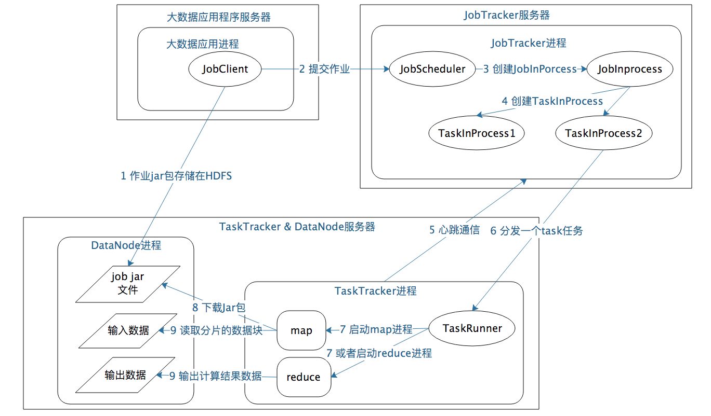

# 从0开始学大数据
## 搜索引擎->数据仓库->数据挖掘->机器学习
在数据仓库时代，只要有数据，几乎就一定要进行统计分析，除了数据统计，我们还希望发掘出更多数据的价值，大数据随之进入数据挖掘时代。

大数据时代，可以把全部的历史数据都收集起来，统计其规律，进而预测正在发生的事情，这就是机器学习。将人类活动产生的数据，通过机器学习得到统计规律，进而可以模拟人的行为，这就是人工智能 AI。

## 移动计算程序到数据所在位置进行计算
传统的软件计算处理模型，都是“输入 -> 计算 -> 输出”模型。也就是说，一个程序给它传入一些数据也好，它自己从某个地方读取一些数据也好，总是先有一些输入数据，然后对这些数据进行计算处理，最后得到输出结果。

大数据方案的核心思路是，既然数据是庞大的，而程序要比数据小得多，将数据输入给程序是不划算的，那么就反其道而行之，将程序分发到数据所在的地方进行计算，也就是所谓的移动计算比移动数据更划算。

这也回答了为什么我们不用pandas进行大数据处理，而是用hadoop，pandas仍然是传统的输入->计算->输出

1. 将待处理的大规模数据存储在服务器集群的所有服务器上，主要使用 HDFS 分布式文件存储系统，将文件分成很多块（Block），以块为单位存储在集群的服务器上。
2. 大数据引擎根据集群里不同服务器的计算能力，在每台服务器上启动若干分布式任务执行进程，这些进程会等待给它们分配执行任务。
3. 使用大数据计算框架支持的编程模型进行编程，比如 Hadoop 的 MapReduce 编程模型，或者 Spark 的 RDD 编程模型。应用程序编写好以后，将其打包，MapReduce 和 Spark 都是在 JVM 环境中运行，所以打包出来的是一个 Java 的 JAR 包。这也进一步解释了为什么包括pyspark也要求提供的是一个包
4. 用 Hadoop 或者 Spark 的启动命令执行这个应用程序的 JAR 包，首先执行引擎会解析程序要处理的数据输入路径，根据输入数据量的大小，将数据分成若干片（Split），每一个数据片都分配给一个任务执行进程去处理。
5. 任务执行进程收到分配的任务后，检查自己是否有任务对应的程序包，如果没有就去下载程序包，下载以后通过反射的方式加载程序。走到这里，最重要的一步，也就是移动计算就完成了。
6. 加载程序后，任务执行进程根据分配的数据片的文件地址和数据在文件内的偏移量读取数据，并把数据输入给应用程序相应的方法去执行，从而实现在分布式服务器集群中移动计算程序，对大规模数据进行并行处理的计算目标。

## HDFS
大规模数据存储解决3个核心问题
* 数据存储容量的问题
* 数据读写速度的问题
* 数据可靠性的问题

DataNode 负责文件数据的存储和读写操作，HDFS 将文件数据分割成若干数据块（Block），每个 DataNode 存储一部分数据块，这样文件就分布存储在整个 HDFS 服务器集群中。应用程序客户端（Client）可以并行对这些数据块进行访问，从而使得 HDFS 可以在服务器集群规模上实现数据并行访问，极大地提高了访问速度。

NameNode 负责整个分布式文件系统的元数据（MetaData）管理，也就是文件路径名、数据块的 ID 以及存储位置等信息，相当于操作系统中文件分配表（FAT）的角色。HDFS 为了保证数据的高可用，会将一个数据块复制为多份（默认为 3 份.

HDFS 的高可用设计:
* 数据存储故障容错: 在数据层面通过checksum保障数据完整性.HDFS的应对措施是，对于存储在 DataNode 上的数据块，计算并存储校验和（CheckSum）。在读取数据的时候，重新计算读取出来的数据的校验和，如果校验不正确就抛出异常，应用程序捕获异常后就到其他 DataNode 上读取备份数据。

* 磁盘故障容错: 如果DataNode监测到本机的某块磁盘损坏，就将该块磁盘上存储的所有 BlockID 报告给 NameNode，NameNode 检查这些数据块还在哪些 DataNode 上有备份，通知相应的 DataNode 服务器将对应的数据块复制到其他服务器上，以保证数据块的备份数满足要求。

* DataNode 故障容错DataNode: 会通过心跳和 NameNode 保持通信，如果 DataNode 超时未发送心跳，NameNode 就会认为这个 DataNode 已经宕机失效，立即查找这个 DataNode 上存储的数据块有哪些，以及这些数据块还存储在哪些服务器上，随后通知这些服务器再复制一份数据块到其他服务器上，保证 HDFS存储的数据块备份数符合用户设置的数目，即使再出现服务器宕机，也不会丢失数据。

* NameNode故障容错: NameNode 是整个 HDFS 的核心，记录着 HDFS 文件分配表信息，所有的文件路径和数据块存储信息都保存在 NameNode.
NameNode 采用主从热备的方式提供高可用服务,集群部署两台 NameNode服务器，一台作为主服务器提供服务，一台作为从服务器进行热备，两台服务器通过 ZooKeeper选举，主要是通过争夺 znode 锁资源，决定谁是主服务器。而 DataNode 则会向两个 NameNode 同时发送心跳数据，但是只有主 NameNode 才能向 DataNode 返回控制信息。正常运行期间，主从 NameNode 之间通过一个共享存储系统 shared edits 来同步文件系统的元数据信息。当主 NameNode 服务器宕机，从 NameNode 会通过 ZooKeeper升级成为主服务器，并保证HDFS集群的元数据信息，也就是文件分配表信息完整一致。

HDFS 一般的访问模式是通过 MapReduce 程序在计算时读取，MapReduce对输入数据进行分片读取，通常一个分片就是一个数据块，每个数据块分配一个计算进程，这样就可以同时启动很多进程对一个 HDFS文件的多个数据块进行并发访问，从而实现数据的高速访问。

## MapReduce
** MapReduce 既是编程模型又是计算框架 **
在 Map 阶段为每个数据块分配一个 Map 计算任务，然后将所有 map 输出的 Key 进行合并，相同的 Key 及其对应的 Value 发送给同一个 Reduce 任务去处理。

### MapReduce 作业启动和运行
如何为每个数据块分配一个 Map 计算任务，也就是代码是如何发送到数据块所在服务器的，发送后是如何启动的，启动以后如何知道自己需要计算的数据在文件什么位置

### MapReduce 数据合并与连接
处于不同服务器的 map 输出的 ，如何把相同的 Key 聚合在一起发送给 Reduce 任务进行处理

1. 大数据应用进程。这类进程是启动 MapReduce 程序的主入口，主要是指定 Map 和 Reduce 类、输入输出文件路径等，并提交作业给 Hadoop 集群，也就是下面提到的 JobTracker 进程。这是由用户启动的 MapReduce 程序进程， 可以理解为spark submit时启动的进程。

2. JobTracker 进程。这类进程根据要处理的输入数据量，命令下面提到的 TaskTracker 进程启动相应数量的Map和Reduce进程任务，并管理整个作业生命周期的任务调度和监控。这是 Hadoop 集群的常驻进程，需要注意的是，JobTracker 进程在整个 Hadoop 集群全局唯一.在CDH中针对每个应用的监控应该就是基于这个JobTracker.

3. TaskTracker 进程。这个进程负责启动和管理Map进程以及Reduce进程。因为需要每个数据块都有对应的 map 函数，TaskTracker进程通常和HDFS的DataNode进程启动在同一个服务器。也就是说，Hadoop 集群中绝大多数服务器同时运行DataNode进程和TaskTracker 进程。

JobTracker 进程和 TaskTracker 进程是主从关系，主服务器通常只有一台,从服务器可能有几百上千台，所有的从服务器听从主服务器的控制和调度安排。主服务器负责为应用程序分配服务器资源以及作业执行的调度，而具体的计算操作则在从服务器上完成。

具体来看，MapReduce的主服务器就是JobTracker，从服务器就是TaskTracker。HDFS 的主服务器是 NameNode，从服务器是 DataNode。Yarn、Spark等也都是这样的架构，这种一主多从的服务器架构也是绝大多数大数据系统的架构方案。

重复使用的架构方案叫作架构模式，一主多从可谓是大数据领域的最主要的架构模式。主服务器只有一台，掌控全局；从服务器很多台，负责具体的事情。这样很多台服务器可以有效组织起来，对外表现出一个统一又强大的计算能力。

1. 应用进程 JobClient 将用户作业 JAR 包存储在 HDFS 中，将来这些 JAR 包会分发给 Hadoop 集群中的服务器执行 MapReduce 计算。2. 应用程序提交 job 作业给 JobTracker。3.JobTracker 根据作业调度策略创建 JobInProcess 树，每个作业都会有一个自己的 JobInProcess 树。4.JobInProcess 根据输入数据分片数目（通常情况就是数据块的数目）和设置的 Reduce 数目创建相应数量的 TaskInProcess。5.TaskTracker 进程和 JobTracker 进程进行定时通信。6. 如果 TaskTracker 有空闲的计算资源（有空闲 CPU 核心），JobTracker 就会给它分配任务。分配任务的时候会根据 TaskTracker 的服务器名字匹配在同一台机器上的数据块计算任务给它，使启动的计算任务正好处理本机上的数据，以实现我们一开始就提到的“移动计算比移动数据更划算”。7.TaskTracker 收到任务后根据任务类型（是 Map 还是 Reduce）和任务参数（作业 JAR 包路径、输入数据文件路径、要处理的数据在文件中的起始位置和偏移量、数据块多个备份的 DataNode 主机名等），启动相应的 Map 或者 Reduce 进程。8.Map 或者 Reduce 进程启动后，检查本地是否有要执行任务的 JAR 包文件，如果没有，就去 HDFS 上下载，然后加载 Map 或者 Reduce 代码开始执行。9. 如果是 Map 进程，从 HDFS 读取数据（通常要读取的数据块正好存储在本机）；如果是 Reduce 进程，将结果数据写出到 HDFS。