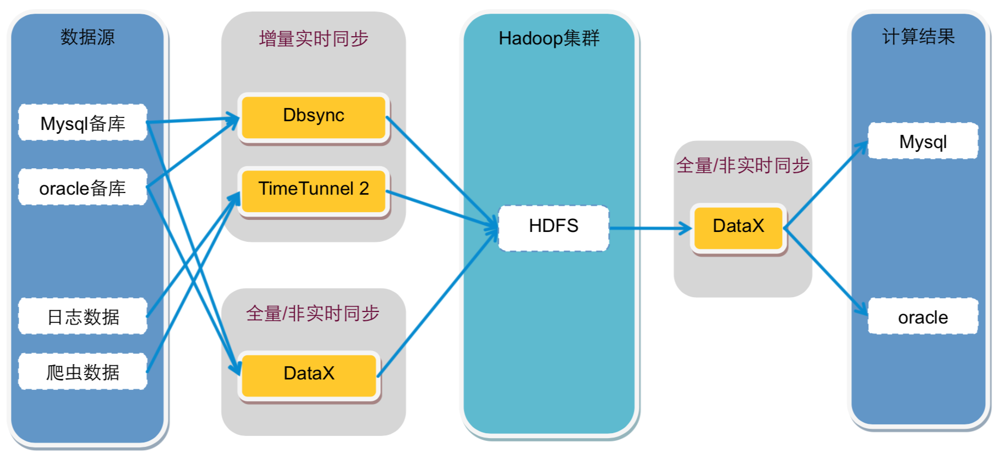
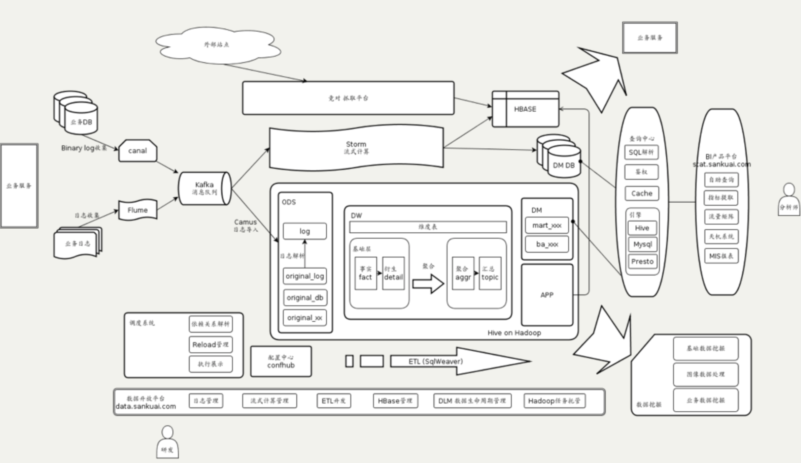
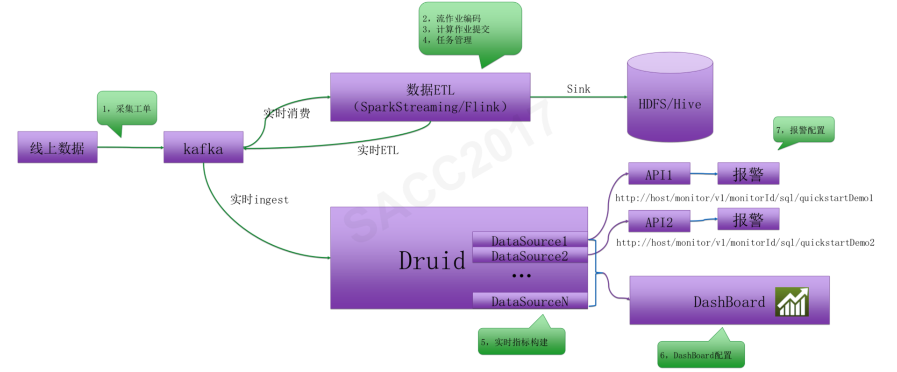
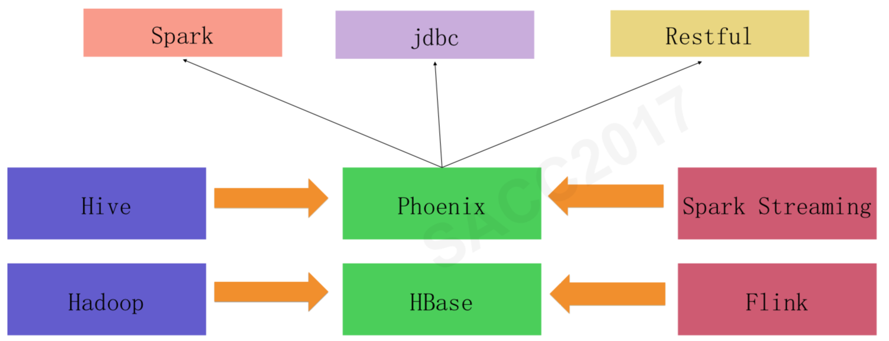

## 互联网大数据平台
互联网大数据平台

这种架构也可以称为lambda架构,是构建大数据平台的一种常规架构原型方案。

1. 数据（new data）同时写入到批处理大数据层（batch layer）和流处理大数据层（speed layer）。

2. 批处理大数据层是数据主要存储与计算的地方，所有的数据最终都会存储到批处理大数据层，并在这里被定期计算处理。

3. 批处理大数据层的计算结果输出到服务层（serving layer），供应用使用者查询访问。

4. 由于批处理的计算速度比较慢，数据只能被定期处理计算（比如每天），因此延迟也比较长（只能查询到截止前一天的数据，即数据输出需要T+1）。所以对于实时性要求比较高的查询，会交给流处理大数据层（speed layer），在这里进行即时计算，快速得到结果。5

5. 流处理计算速度快，但是得到的只是最近一段时间的数据计算结果（比如当天的）；批处理会有延迟，但是有全部的数据计算结果。所以查询访问会将批处理计算的结果和流处理计算的结果合并起来，作为最终的数据视图呈现。

##data platform example

数据源主要来自 Oracle和MySQL的备库，以及日志系统和爬虫系统，这些数据通过数据同步网关服务器导入到 Hadoop 集群中。其中 DataExchange 非实时全量同步数据库数据，DBSync 实时同步数据库增量数据，TimeTunnel 实时同步日志和爬虫数据。数据全部写入到 HDFS 中。
Hadoop 中的计算任务会通过天网调度系统，根据集群资源和作业优先级，调度作业的提交和执行。计算结果写入到 HDFS，再经过 DataExchange 同步到 MySQL 和 Oracle 数据库。处于平台下方的数据魔方、推荐系统等从数据库中读取数据，就可以实时响应用户的操作请求。

美团大数据平台的数据源来自 MySQL 数据库和日志，数据库通过 Canal 获得 MySQL 的 binlog，输出给消息队列 Kafka，日志通过 Flume 也输出到 Kafka。
Kafka 的数据会被流式计算和批处理计算两个引擎分别消费。流处理使用 Storm 进行计算，结果输出到 HBase 或者数据库。批处理计算使用 Hive 进行分析计算，结果输出到查询系统和 BI（商业智能）平台。数据分析师可以通过 BI 产品平台进行交互式的数据查询访问，也可以通过可视化的报表工具查看已经处理好的常用分析指标。公司高管也是通过这个平台上的天机系统查看公司主要业务指标和报表。

滴滴大数据平台分为实时计算平台（流式计算平台）和离线计算平台（批处理计算平台）两个部分。实时计算平台架构如下。数据采集以后输出到 Kafka 消息队列，消费通道有两个，一个是数据 ETL，使用 Spark Streaming 或者 Flink 将数据进行清洗、转换、处理后记录到 HDFS 中，供后续批处理计算。另一个通道是 Druid，计算实时监控指标，将结果输出到报警系统和实时图表系统 DashBoard。

离线计算平台架构如下。滴滴的离线大数据平台是基于 Hadoo 2（HDFS、Yarn、MapReduce）和 Spark 以及 Hive 构建，在此基础上开发了自己的调度系统和开发系统。调度系统和前面其他系统一样，调度大数据作业的优先级和执行顺序。开发平台是一个可视化的 SQL 编辑器，可以方便地查询表结构、开发 SQL，并发布到大数据集群上
此外，滴滴还对 HBase 重度使用，并对相关产品（HBase、Phoenix）做了一些自定义的开发，维护着一个和实时、离线两个大数据平台同级别的 HBase 平台，它的架构图如下

来自于实时计算平台和离线计算平台的计算结果被保存到 HBase 中，然后应用程序通过 Phoenix 访问 HBase。而 Phoenix 是一个构建在 HBase 上的 SQL 引擎，可以通过 SQL 方式访问 HBase 上的数据。