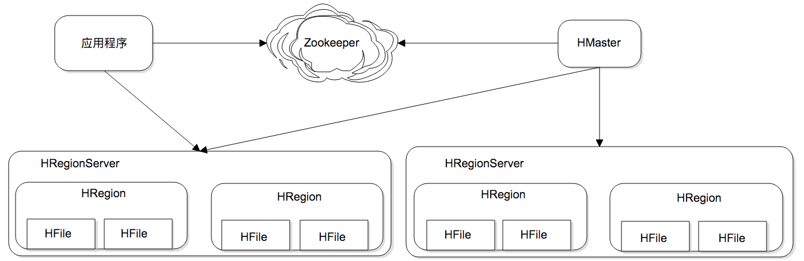
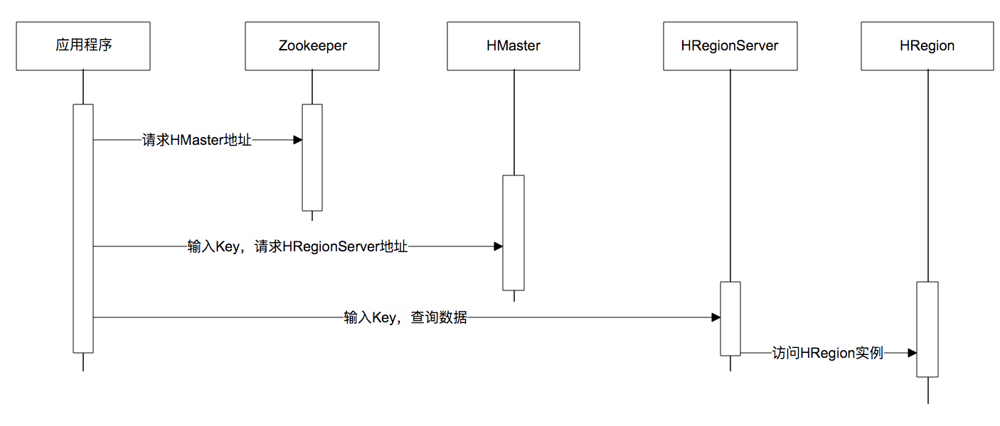

学习关系数据库都要学习数据库设计范式,事实上，是在数据存储中包含了一部分业务逻辑。而NoSQL数据库则简单暴力地认为，数据库就是存储数据的，业务逻辑应该由应用程序去处理.

## HBase 可伸缩架构

HBase 的伸缩性主要依赖其可分裂的 HRegion 及可伸缩的分布式文件系统 HDFS 实现。
HRegion 是 HBase 负责数据存储的主要进程，应用程序对数据的读写操作都是通过和 HRegion 通信完成。上面是 HBase 架构图，我们可以看到在 HBase 中，数据以 HRegion 为单位进行管理，也就是说应用程序如果想要访问一个数据，必须先找到HRegion，然后将数据读写操作提交给 HRegion，由 HRegion 完成存储层面的数据操作。

HRegionServer 是物理服务器，每个 HRegionServer 上可以启动多个 HRegion 实例。当一个 HRegion 中写入的数据太多，达到配置的阈值时，一个 HRegion 会分裂成两个 HRegion，并将 HRegion 在整个集群中进行迁移，以使 HRegionServer 的负载均衡.

每个HRegion 中存储一段 Key 值区间[key1, key2) 的数据，所有 HRegion 的信息，包括存储的 Key 值区间、所在 HRegionServer 地址、访问端口号等，都记录在 HMaster 服务器上。为了保证 HMaster 的高可用，HBase 会启动多个 HMaster，并通过 ZooKeeper 选举出一个主服务器。

下面是一张调用时序图，应用程序通过 ZooKeeper 获得主 HMaster 的地址，输入 Key 值获得这个 Key 所在的 HRegionServer 地址，然后请求 HRegionServer 上的 HRegion，获得所需要的数据。

数据写入过程也是一样，需要先得到 HRegion 才能继续操作。HRegion 会把数据存储在若干个 HFile 格式的文件中，这些文件使用 HDFS 分布式文件系统存储，在整个集群内分布并高可用。当一个 HRegion 中数据量太多时，这个 HRegion 连同 HFile 会分裂成两个 HRegion，并根据集群中服务器负载进行迁移。如果集群中有新加入的服务器，也就是说有了新的 HRegionServer，由于其负载较低，也会把 HRegion 迁移过去并记录到 HMaster，从而实现 HBase 的线性伸缩。

HBase 的核心设计目标是解决海量数据的分布式存储，HBase 的做法是按 Key 的区域进行分片，这个分片也就是 HRegion。应用程序通过 HMaster 查找分片，得到 HRegion 所在的服务器HRegionServer，然后和该服务器通信，就得到了需要访问的数据。

## HBase可扩展数据模型
许多NoSQL数据库使用的列族（ColumnFamily）设计就是其中一个解决不用修改表结构就可以新增字段的方案
一个学生的基本信息表，表中不同学生的联系方式各不相同，选修的课程也不同， 而且将来还会有更多联系方式和课程加入到这张表里，如果按照传统的关系数据库设计，无论提前预设多少冗余字段都会捉襟见肘、疲于应付。
```
key  联系方式(column family)      课程成绩
001  weibo: 123456|tel:123|       English:90|Chinese:95|
002               |tel:456|qq:123           |Chinese:95|Math:96
003  weibo: 123456|tel:123|qq:145            Chinese:97
```

而使用支持列族结构的 NoSQL 数据库，在创建表的时候，只需要指定列族的名字，无需指定字段（Column）。那什么时候指定字段呢？可以在数据写入时再指定。通过这种方式，数据表可以包含数百万的字段，这样就可以随意扩展应用程序的数据结构了。并且这种数据库在查询时也很方便，可以通过指定任意字段名称和值进行查询。
HBase 这种列族的数据结构设计，实际上是把字段的名称和字段的值，以 Key-Value 的方式一起存储在HBase中。实际写入的时候，可以随意指定字段名称，即使有几百万个字段也能轻松应对。

## HBase 的高性能存储
为了提高数据写入速度，HBase 使用了一种叫作 LSM 树的数据结构进行数据存储。LSM 树的全名是 Log Structed Merge Tree，翻译过来就是 Log 结构合并树。数据写入的时候以 Log 方式连续写入，然后异步对磁盘上的多个 LSM 树进行合并。

LSM 树可以看作是一个 N 阶合并树。数据写操作（包括插入、修改、删除）都在内存中进行，并且都会创建一个新记录（修改会记录新的数据值，而删除会记录一个删除标志）。这些数据在内存中仍然还是一棵排序树，当数据量超过设定的内存阈值后，会将这棵排序树和磁盘上最新的排序树合并。当这棵排序树的数据量也超过设定阈值后，会和磁盘上下一级的排序树合并。合并过程中，会用最新更新的数据覆盖旧的数据（或者记录为不同版本）。在需要进行读操作时，总是从内存中的排序树开始搜索，如果没有找到，就从磁盘 上的排序树顺序查找。在 LSM 树上进行一次数据更新不需要磁盘访问，在内存即可完成。当数据访问以写操作为主，而读操作则集中在最近写入的数据上时，使用 LSM 树可以极大程度地减少磁盘的访问次数，加快访问速度。

## HBase 的列族数据结构的缺点
* 列族不好查询，没有传统sql那样按照不同字段方便，只能根据rowkey查询，范围查询scan性能低。
* 查询也没有mysql一样的走索引优化，因为列不固定 
* 列族因为不固定，所以很难做一些业务约束