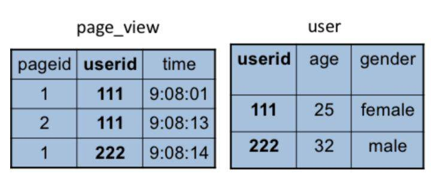
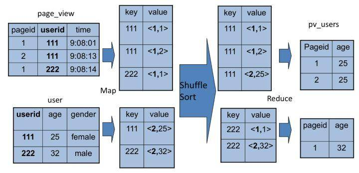

## Hive的架构

我们通过 Hive 的 Client（Hive 的命令行工具，JDBC 等）向 Hive 提交 SQL 命令。如果是创建数据表的 DDL（数据定义语言），Hive 就会通过执行引擎 Driver 将数据表的信息记录在 Metastore 元数据组件中，这个组件通常用一个关系数据库实现，记录表名、字段名、字段类型、关联 HDFS 文件路径等这些数据库的 Meta 信息（元信息）。

如果我们提交的是查询分析数据的 DQL（数据查询语句），Driver 就会将该语句提交给自己的编译器Compiler进行语法分析、语法解析、语法优化等一系列操作，最后生成一个 MapReduce 执行计划。然后根据执行计划生成一个 MapReduce 的作业，提交给 Hadoop MapReduce 计算框架处理。
Hive SQL语句 => 语法分析 => AST =>
生成逻辑执行计划 => Operator Tree =>
优化逻辑执行计划 => Optimized Operator Tree =>
生成物理执行计划 => Task Tree =>
优化物理执行计划 => Optimized Task Tree =>
执行优化后的Optimized Task Tree


## Hive 实现 join 操作
```
SELECT pv.pageid, u.age FROM page_view pv JOIN user u ON (pv.userid = u.userid);
```

以以上join为例，

因为 join 涉及两张表，来自两个文件（夹），所以需要在 map 输出的时候进行标记，比如来自第一张表的输出 Value 就记录为 <1, X>，这里的 1 表示数据来自第一张表。这样经过 shuffle 以后，相同的 Key 被输入到同一个 reduce 函数，就可以根据表的标记对Value数据求笛卡尔积，用第一张表的每条记录和第二张表的每条记录连接，输出就是 join 的结果。


## Hive On Spark vs Spark Sql
** hive on Spark和SparkSQL的结构类似，只是SQL引擎不同，但是计算引擎都是spark **
sparkSQL通过sqlcontext来进行使用，hive on spark通过hivecontext来使用。sqlcontext和hivecontext都是来自于同一个包，从这个层面上理解，其实hive on spark和sparkSQL并没有太大差别。
结构上来看，Hive on Spark和SparkSQL都是一个翻译器，将SQL翻译成分布是可以执行的Spark程序。

* SQLContext：spark处理结构化数据的入口，允许创建DataFrame以及sql查询。

* HiveContext：Spark sql执行引擎，集成hive数据，读取在classpath的hive-site.xml配置文件配置hive。

* Hive on Mapreduce场景
Hive的出现可以让那些精通SQL技能、但是不熟悉MapReduce 、编程能力较弱与不擅长Java语言的用户能够在HDFS大规模数据集上很方便地利用SQL 语言查询、汇总、分析数据，毕竟精通SQL语言的人要比精通Java语言的多得多
Hive适合处理离线非实时数据
* SparkSQL场景
Spark既可以运行本地local模式，也可以以Standalone、cluster等多种模式运行在Yarn、Mesos上，还可以运行在云端例如EC2。此外，Spark的数据来源非常广泛，可以处理来自HDFS、HBase、 Hive、Cassandra、Tachyon上的各种类型的数据。
实时性要求或者速度要求较高的场所

以数仓项目为例，既然选用Hive作为数据仓库，那么查询使用Hive On Spark更优

## Hive On Spark的计算原理
1. 将Hive表作为Spark RDD来进行操作；

2. 使用Hive原语
对于一些针对RDD的操作，比如groupByKey、sortByKey等；不使用Spark的transformation操作和原语。如果那样做的话，那么就需要重新实现一套Hive的原语，而且如果Hive增加了新功能，那么又要实现新的Spark原语。因此选择将Hive的原语包装为针对RDD的操作即可。

3. 新的物理执行计划生成机制
使用SparkCompiler将逻辑执行计划，即Operator Tree，转换为Task Tree，提交Spark Task给Spark进行执行。SparkTask包装了DAG，DAG包装为SparkWork，SparkTask根据SparkWork表示的DAG计算。

4. SparkContext生命周期
Hive On Spark会为每个用户的会话，比如执行一次SQL语句，创建一个SparkContext。但是Spark不允许在一个JVM内创建多个SparkContext。因此，需要在单独的JVM中启动每个会话的SparkContext，然后通过RPC与远程JVM中的SparkContext进行通信。

5、本地和远程运行模式
Hive On Spark提供两种运行模式，本地和远程。如果将Spark Master设置为local，比如set spark.master=local，那么就是本地模式，SparkContext与客户端运行在一个JVM中。否则，如果将Spark Master设置为Master的地址，那么就是远程模式，SparkContext会在远程的JVM中启动。
远程模式下，每个用户Session都会创建一个SparkClient，SparkClient启动RemoteDriver，RemoteDriver负责创建SparkContext。
