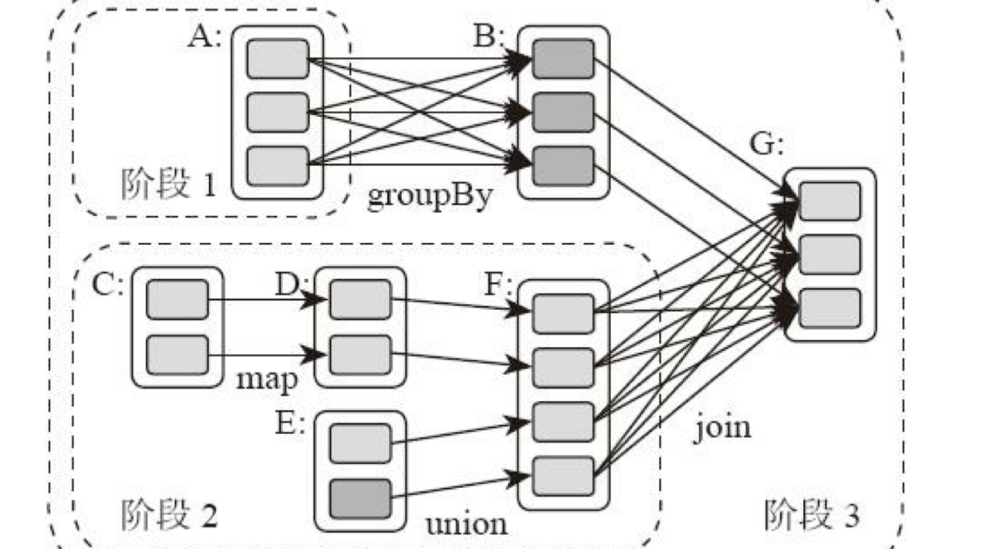
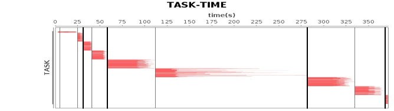
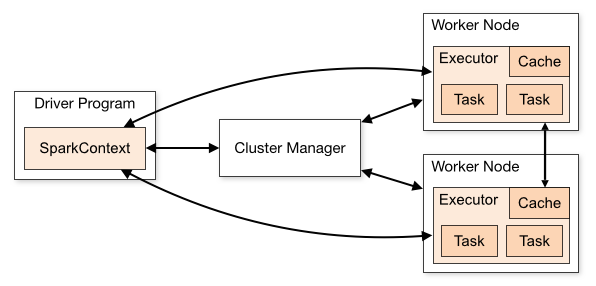

##  Spark编程模型
MapReduce 针对输入数据，将计算过程分为两个阶段，一个 Map 阶段，一个 Reduce 阶段，可以理解成是面向过程的大数据计算。我们在用 MapReduce 编程的时候，思考的是，如何将计算逻辑用 Map 和 Reduce 两个阶段实现，map 和 reduce 函数的输入和输出是什么，这也是我们在学习 MapReduce 编程的时候一再强调的。

Spark 则直接针对数据进行编程，将大规模数据集合抽象成一个 RDD 对象，然后在这个 RDD 上进行各种计算处理，得到一个新的RDD，继续计算处理，直到得到最后的结果数据。所以 Spark 可以理解成是面向对象的大数据计算。我们在进行 Spark 编程的时候，思考的是一个 RDD 对象需要经过什么样的操作，转换成另一个 RDD 对象，思考的重心和落脚点都在 RDD 上。

RDD 上定义的函数分两种，一种是转换（transformation）函数，这种函数的返回值还是 RDD.，比如有计算 map(func)、过滤 filter(func)、合并数据集 union(otherDataset)、根据 Key 聚合 reduceByKey(func, [numPartitions])、连接数据集 join(otherDataset, [numPartitions])、分组 groupByKey([numPartitions]) 等十几个函数。

跟 MapReduce 一样，Spark 也是对大数据进行分片计算，Spark 分布式计算的数据分片、任务调度都是以 RDD 为单位展开的，每个 RDD 分片都会分配到一个执行进程去处理。

RDD 上的转换操作又分成两种，一种转换操作产生的 RDD 不会出现新的分片，比如 map、filter 等，也就是说一个 RDD 数据分片，经过 map 或者 filter 转换操作后，结果还在当前分片。就像你用 map 函数对每个数据加 1，得到的还是这样一组数据，只是值不同。实际上，Spark 并不是按照代码写的操作顺序去生成 RDD，比如rdd2 = rdd1.map(func)这样的代码并不会在物理上生成一个新的 RDD。物理上，Spark 只有在产生新的 RDD 分片时候，才会真的生成一个 RDD，Spark 的这种特性也被称作惰性计算。

另一种转换操作产生的 RDD 则会产生新的分片，比如reduceByKey，来自不同分片的相同 Key 必须聚合在一起进行操作，这样就会产生新的RDD分片。实际执行过程中，是否会产生新的 RDD 分片，并不是根据转换函数名就能判断出来的

Spark 应用程序代码中的 RDD 和 Spark 执行过程中生成的物理 RDD 不是一一对应的，RDD 在 Spark 里面是一个非常灵活的概念.

## Spark的计算阶段
Spark 也遵循移动计算比移动数据更划算这一大数据计算基本原则
首先和 MapReduce 一个应用一次只运行一个 map 和一个 reduce 不同，Spark 可以根据应用的复杂程度，分割成更多的计算阶段（stage），这些计算阶段组成一个有向无环图 DAG，Spark 任务调度器可以根据 DAG 的依赖关系执行计算阶段

DAG 也就是有向无环图，就是说不同阶段的依赖关系是有向的，计算过程只能沿着依赖关系方向执行，被依赖的阶段执行完成之前，依赖的阶段不能开始执行，同时，这个依赖关系不能有环形依赖，否则就成为死循环了。下面这张图描述了一个典型的 Spark 运行 DAG 的不同阶段。

从图上看，整个应用被切分成 3 个阶段，阶段 3 需要依赖阶段 1 和阶段 2，阶段 1 和阶段 2 互不依赖。Spark 在执行调度的时候，先执行阶段 1 和阶段 2，完成以后，再执行阶段 3。如果有更多的阶段，Spark 的策略也是一样的。只要根据程序初始化好DAG，就建立了依赖关系，然后根据依赖关系顺序执行各个计算阶段，Spark 大数据应用的计算就完成了。

可以看到 Spark 作业调度执行的核心是 DAG，有了 DAG，整个应用就被切分成哪些阶段，每个阶段的依赖关系也就清楚了。之后再根据每个阶段要处理的数据量生成相应的任务集合（TaskSet），每个任务都分配一个任务进程去处理，Spark 就实现了大数据的分布式计算。

具体来看的话，负责 Spark 应用 DAG 生成和管理的组件是 DAGScheduler，DAGScheduler 根据程序代码生成 DAG，然后将程序分发到分布式计算集群，按计算阶段的先后关系调度执行。![spark_dag]

关于计算阶段的划分从图上就能看出规律，当RDD之间的转换连接线呈现多对多交叉连接的时候，就会产生新的阶段。一个RDD代表一个数据集，图中每个RDD里面都包含多个小块，每个小块代表 RDD 的一个分片。一个数据集中的多个数据分片需要进行分区传输，写入到另一个数据集的不同分片中，这就是 shuffle 过程.

Spark 也需要通过shuffle将数据进行重新组合，相同Key的数据放在一起，进行聚合、关联等操作，因而每次 shuffle 都产生新的计算阶段。这也是为什么计算阶段会有依赖关系，它需要的数据来源于前面一个或多个计算阶段产生的数据，必须等待前面的阶段执行完毕才能进行 shuffle，并得到数据. ** 计算阶段划分的依据是 shuffle，不是转换函数的类型 **

有的函数有时候有 shuffle，有时候没有。比如上图例子中 RDD B 和 RDD F 进行 join，得到 RDD G，这里的 RDD F 需要进行 shuffle，RDD B就不需要。因为 RDD B 在前面一个阶段，阶段 1 的 shuffle 过程中，已经进行了数据分区。分区数目和分区 Key 不变，就不需要再进行 shuffle。这种不需要进行 shuffle 的依赖，在 Spark 里被称作窄依赖；相反的，需要进行 shuffle 的依赖，被称作宽依赖。

## Spark的作业管理
Spark 里面的 RDD 函数有两种，一种是转换函数，调用以后得到的还是一个 RDD，RDD 的计算逻辑主要通过转换函数完成。另一种是 action 函数，调用以后不再返回 RDD。比如 count() 函数，返回 RDD 中数据的元素个数；saveAsTextFile(path)，将 RDD 数据存储到 path 路径下。Spark 的 DAGScheduler 在遇到 shuffle 的时候，会生成一个计算阶段，在遇到 action 函数的时候，会生成一个作业（job）。

RDD 里面的每个数据分片，Spark 都会创建一个计算任务去处理，所以一个计算阶段会包含很多个计算任务（task）。关于作业、计算阶段、任务的依赖和时间先后关系你可以通过下图看到。

图中横轴方向是时间，纵轴方向是任务。两条粗黑线之间是一个作业，两条细线之间是一个计算阶段。一个作业至少包含一个计算阶段。水平方向红色的线是任务，每个阶段由很多个任务组成，这些任务组成一个任务集合。DAGScheduler 根据代码生成 DAG 图以后,Spark的任务调度就以任务为单位进行分配，将任务分配到分布式集群的不同机器上执行。

## Spark的执行过程

Spark 支持 Standalone、Yarn、Mesos、Kubernetes 等多种部署方案，几种部署方案原理也都一样，只是不同组件角色命名不同，但是核心功能和运行流程都差不多。

1. 首先，Spark 应用程序启动在自己的 JVM 进程里，即 Driver 进程，启动后调用 SparkContext 初始化执行配置和输入数据。SparkContext 启动 DAGScheduler 构造执行的 DAG 图，切分成最小的执行单位也就是计算任务。
2. 然后 Driver 向 Cluster Manager 请求计算资源，用于 DAG 的分布式计算。Cluster Manager 收到请求以后，将 Driver 的主机地址等信息通知给集群的所有计算节点 Worker。
3. Worker 收到信息以后，根据 Driver 的主机地址，跟 Driver 通信并注册，然后根据自己的空闲资源向 Driver 通报自己可以领用的任务数。Driver 根据 DAG 图开始向注册的 Worker 分配任务。
4. Worker 收到任务后，启动 Executor 进程开始执行任务。Executor 先检查自己是否有 Driver 的执行代码，如果没有，从 Driver 下载执行代码，通过 Java 反射加载后开始执行。