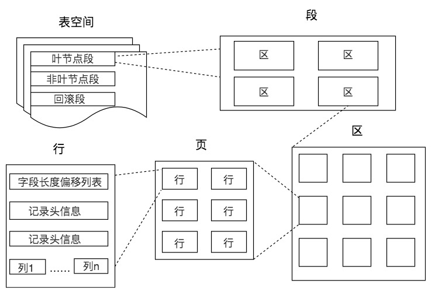
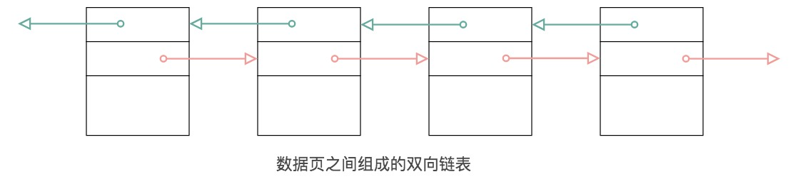

## 范式设计
设计关系型数据库模型的时候，需要对关系内部各个属性之间联系的合理化程度进行定义，这就有了不同等级的规范要求，这些规范要求被称为范式（NF）。你可以把范式理解为，一张数据表的设计结构需要满足的某种设计标准的级别。

数据库的范式设计越高阶，冗余度就越低，同时高阶的范式一定符合低阶范式的要求，比如满足 2NF 的一定满足 1NF，满足 3NF 的一定满足 2NF，依次类推。

范式的定义会使用到主键和候选键（因为主键和候选键可以唯一标识元组），数据库中的键（Key）由一个或者多个属性组成。数据表中常用的几种键和属性的定义：
* 超键：能唯一标识元组的属性集叫做超键。
* 候选键：如果超键不包括多余的属性，那么这个超键就是候选键。
* 主键：用户可以从候选键中选择一个作为主键。
* 外键：如果数据表 R1 中的某属性集不是 R1 的主键，而是另一个数据表 R2 的主键，那么这个属性集就是数据表 R1 的外键。
* 主属性：包含在任一候选键中的属性称为主属性。
* 非主属性：与主属性相对，指的是不包含在任何一个候选键中的属性。

以 NBA 的球员表（player）和球队表（team）为例。这里我可以把球员表定义为包含球员编号、姓名、身份证号、年龄和球队编号；球队表包含球队编号、主教练和球队所在地。对于球员表来说，超键就是包括球员编号或者身份证号的任意组合，比如（球员编号）（球员编号，姓名）（身份证号，年龄）等。候选键就是最小的超键，对于球员表来说，候选键就是（球员编号）或者（身份证号）。主键是我们自己选定，也就是从候选键中选择一个，比如（球员编号）。外键就是球员表中的球队编号。在 player 表中，主属性是（球员编号）（身份证号），其他的属性（姓名）（年龄）（球队编号）都是非主属性。


* 1NF指的是数据库表中的任何属性都是原子性的，不可再分。这很好理解，我们在设计某个字段的时候，对于字段 X 来说，就不能把字段 X 拆分成字段 X-1 和字段 X-2。事实上，任何的 DBMS 都会满足第一范式的要求，不会将字段进行拆分。
* 2NF指的数据表里的非主属性都要和这个数据表的候选键有完全依赖关系。所谓完全依赖不同于部分依赖，也就是不能仅依赖候选键的一部分属性，而必须依赖全部属性。
* 3NF在满足2NF的同时，对任何非主属性都不传递依赖于候选键。也就是说不能存在非主属性A 依赖于非主属性 B，非主属性 B 依赖于候选键的情况。
* 1NF 需要保证表中每个属性都保持原子性；2NF需要保证表中的非主属性与候选键完全依赖；3NF 需要保证表中的非主属性与候选键不存在传递依赖。
* BCNF，也叫做巴斯-科德范式，它在3NF的基础上消除了主属性对候选键的部分依赖或者传递依赖关系

## 数据库中的存储结构
记录是按照行来存储的，但是数据库的读取并不以行为单位，否则一次读取（也就是一次 I/O 操作）只能处理一行数据，效率会非常低。因此在数据库中，不论读一行，还是读多行，都是将这些行所在的页进行加载。也就是说，数据库管理存储空间的基本单位是页（Page）。
数据库存储的基本单位是页，对于一棵 B+ 树的索引来说，是先从根节点找到叶子节点，也就是先查找数据行所在的页，再将页读入到内存中，在内存中对页的记录进行查找，从而得到想要数据。你看，虽然我们想要查找的，只是一行记录，但是对于磁盘 I/O 来说却需要加载一页的信息，因为页是最小的存储单位。那么对于数据库来说，如果我们想要查找多行记
一个页中可以存储多个行记录（Row），同时在数据库中，还存在着区（Extent）、段（Segment）和表空间（Tablespace）。行、页、区、段、表空间的关系如下图所示



* 区（Extent）是比页大一级的存储结构，在 InnoDB 存储引擎中，一个区会分配 64 个连续的页。因为 InnoDB 中的页大小默认是 16KB，所以一个区的大小是 64*16KB=1MB.
* 段（Segment）由一个或多个区组成，区在文件系统是一个连续分配的空间（在 InnoDB 中是连续的 64 个页），不过在段中不要求区与区之间是相邻的。
段是数据库中的分配单位，不同类型的数据库对象以不同的段形式存在。当我们创建数据表、索引的时候，就会相应创建对应的段，比如创建一张表时会创建一个表段，创建一个索引时会创建一个索引段。
* 表空间（Tablespace）是一个逻辑容器，表空间存储的对象是段，在一个表空间中可以有一个或多个段，但是一个段只能属于一个表空间。数据库由一个或多个表空间组成，表空间从管理上可以划分为系统表空间、用户表空间、撤销表空间、临时表空间等。
* 在 InnoDB 中存在两种表空间的类型：共享表空间和独立表空间。如果是共享表空间就意味着多张表共用一个表空间。如果是独立表空间，就意味着每张表有一个独立的表空间，也就是数据和索引信息都会保存在自己的表空间中。独立的表空间可以在不同的数据库之间进行迁移。

页（Page）如果按类型划分的话，常见的有数据页（保存 B+ 树节点）、系统页、Undo 页和事务数据页等。数据页是我们最常使用的页。
表页的大小限定了表行的最大长度，不同 DBMS 的表页大小不同。比如在 MySQL 的 InnoDB 存储引擎中，默认页的大小是 16KB，我们可以通过下面的命令来进行查看：
```
mysql> show variables like '%innodb_page_size%';
```
在 Oracle 中我们用术语“块”（Block）来代表“页”，Oralce 支持的块大小为 2KB，4KB，8KB，16KB，32KB 和 64KB。
数据页包括七个部分，分别是文件头（File Header）、页头（Page Header）、最大最小记录（Infimum+supremum）、用户记录（User Records）、空闲空间（Free Space）、页目录（Page Directory）和文件尾（File Tailer）。

首先是文件通用部分，也就是文件头和文件尾。它们类似集装箱，将页的内容进行封装，通过文件头和文件尾校验的方式来确保页的传输是完整的。
在文件头中有两个字段，分别是 FIL_PAGE_PREV 和 FIL_PAGE_NEXT，它们的作用相当于指针，分别指向上一个数据页和下一个数据页。连接起来的页相当于一个双向的链表，如下图所示：

需要说明的是采用链表的结构让数据页之间不需要是物理上的连续，而是逻辑上的连续。

第二个部分是记录部分，页的主要作用是存储记录，所以“最小和最大记录”和“用户记录”部分占了页结构的主要空间。另外空闲空间是个灵活的部分，当有新的记录插入时，会从空闲空间中进行分配用于存储新记录.

第三部分是索引部分，这部分重点指的是页目录，它起到了记录的索引作用，因为在页中，记录是以单向链表的形式进行存储的。单向链表的特点就是插入、删除非常方便，但是检索效率不高，最差的情况下需要遍历链表上的所有节点才能完成检索，因此在页目录中提供了二分查找的方式，用来提高记录的检索效率。

## 数据库缓冲池
磁盘 I/O 需要消耗的时间很多，而在内存中进行操作，效率则会高很多，为了能让数据表或者索引中的数据随时被我们所用，DBMS 会申请占用内存来作为数据缓冲池，这样做的好处是可以让磁盘活动最小化，从而减少与磁盘直接进行 I/O 的时间。要知道，这种策略对提升 SQL 语句的查询性能来说至关重要。如果索引的数据在缓冲池里，那么访问的成本就会降低很多。
缓冲池管理器会尽量将经常使用的数据保存起来，在数据库进行页面读操作的时候，首先会判断该页面是否在缓冲池中，如果存在就直接读取，如果不存在，就会通过内存或磁盘将页面存放到缓冲池中再进行读取。

实际上，当我们对数据库中的记录进行修改的时候，首先会修改缓冲池中页里面的记录信息，然后数据库会以一定的频率刷新到磁盘上。注意并不是每次发生更新操作，都会立刻进行磁盘回写。缓冲池会采用一种叫做 checkpoint 的机制将数据回写到磁盘上，这样做的好处就是提升了数据库的整体性能。比如，当缓冲池不够用时，需要释放掉一些不常用的页，就可以采用强行采用 checkpoint 的方式，将不常用的脏页回写到磁盘上，然后再从缓冲池中将这些页释放掉。这里脏页（dirty page）指的是缓冲池中被修改过的页，与磁盘上的数据页不一致。

使用的是 InnoDB 存储引擎，可以通过查看 innodb_buffer_pool_size 变量来查看缓冲池的大小，命令如下：
```
## view
mysql > show variables like 'innodb_buffer_pool_size'
## set innodb_buffer_pool_size 128MB
set global innodb_buffer_pool_size=134217728
```
在 InnoDB 存储引擎中，我们可以同时开启多个缓冲池，这里我们看下如何查看缓冲池的个数，使用命令：
```
mysql > show variables like 'innodb_buffer_pool_instances'
```
如果想要开启多个缓冲池，你首先需要将innodb_buffer_pool_size参数设置为大于等于 1GB，这时innodb_buffer_pool_instances才会大于 1。你可以在 MySQL 的配置文件中对innodb_buffer_pool_size进行设置，大于等于 1GB，然后再针对innodb_buffer_pool_instances参数进行修改。

### 数据页加载的三种方式
如果缓冲池中没有该页数据，那么缓冲池有以下三种读取数据的方式，每种方式的读取效率都是不同的：
* 如果该数据存在于内存中，基本上执行时间在 1ms 左右，效率还是很高的。
* 随机读取如果数据没有在内存中，就需要在磁盘上对该页进行查找，整体时间预估在 10ms 左右，这10ms中有6ms是磁盘的实际繁忙时间（包括了寻道和半圈旋转时间），有 3ms 是对可能发生的排队时间的估计值，另外还有1ms的传输时间，将页从磁盘服务器缓冲区传输到数据库缓冲区中。这 10ms 看起来很快，但实际上对于数据库来说消耗的时间已经非常长了，因为这还只是一个页的读取时间。
* 顺序读取顺序读取其实是一种批量读取的方式，因为我们请求的数据在磁盘上往往都是相邻存储的，顺序读取可以帮我们批量读取页面，这样的话，一次性加载到缓冲池中就不需要再对其他页面单独进行磁盘 I/O 操作了。如果一个磁盘的吞吐量是 40MB/S，那么对于一个 16KB大小的页来说，一次可以顺序读取2560（40MB/16KB）个页，相当于一个页的读取时间为 0.4ms。采用批量读取的方式，即使是从磁盘上进行读取，效率也比从内存中只单独读取一个页的效率要高。
果我们想要查看某条 SQL 语句的查询成本，可以在执行完这条 SQL 语句之后，通过查看当前会话中的last_query_cost变量值来得到当前查询的成本。这个查询成本对应的是 SQL 语句所需要读取的页的数量。
mysql> SHOW STATUS LIKE 'last_query_cost';

* 位置决定效率。如果页就在数据库缓冲池中，那么效率是最高的，否则还需要从内存或者磁盘中进行读取，当然针对单个页的读取来说，如果页存在于内存中，会比在磁盘中读取效率高很多。
* 批量决定效率。如果我们从磁盘中对单一页进行随机读，那么效率是很低的（差不多 10ms），而采用顺序读取的方式，批量对页进行读取，平均一页的读取效率就会提升很多，甚至要快于单个页面在内存中的随机读取。