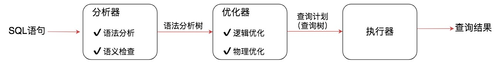
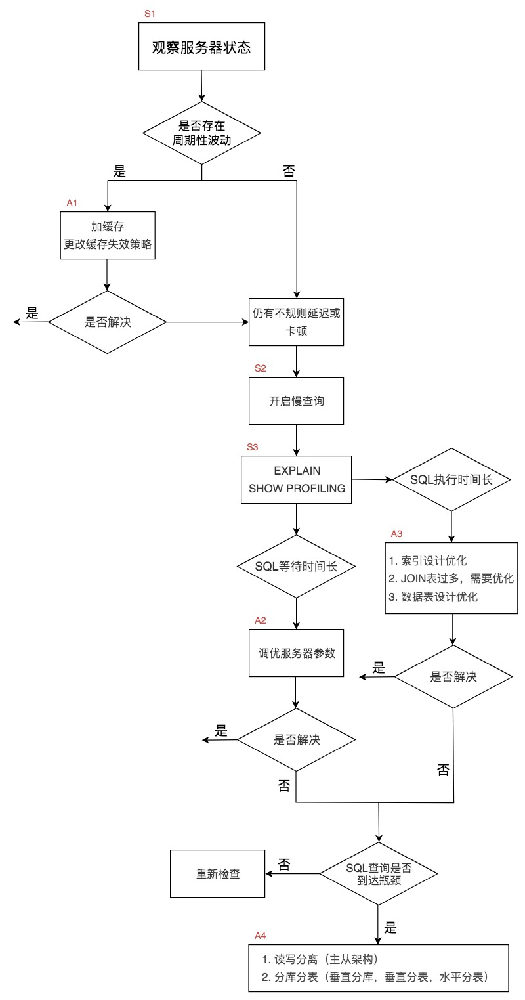
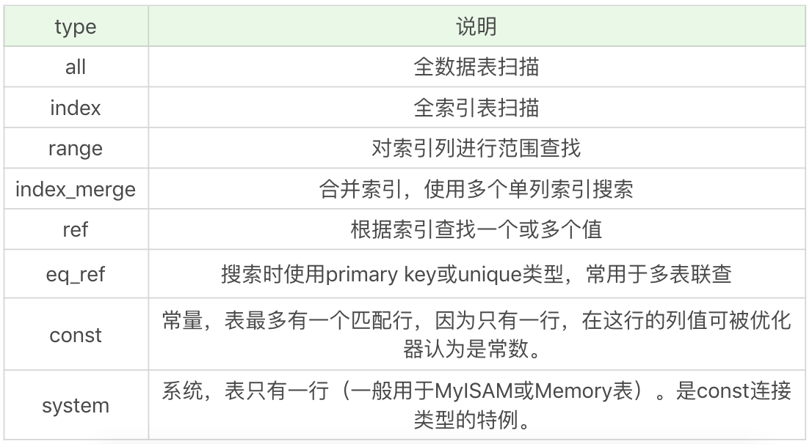

## 查询优化器
SQL 语句的执行经历的环节：

1. 一条 SQL 查询语句首先会经过分析器，进行语法分析和语义检查。语法分析是检查 SQL 拼写和语法是否正确，语义检查是检查 SQL 中的访问对象是否存在。比如我们在写 SELECT 语句的时候，列名写错了，系统就会提示错误。语法检查和语义检查可以保证 SQL 语句没有错误，最终得到一棵语法分析树。
2. 查询优化器的目标是找到执行 SQL 查询的最佳执行计划，执行计划就是查询树，它由一系列物理操作符组成，这些操作符按照一定的运算关系组成查询的执行计划。在查询优化器中，可以分为逻辑查询优化阶段和物理查询优化阶段。
3. 经过查询优化器得到查询计划，最后交给执行器进行执行

### 逻辑查询优化
逻辑查询优化就是通过改变 SQL 语句的内容来使得SQL查询更高效，同时为物理查询优化提供更多的候选执行计划。通常采用的方式是对 SQL 语句进行等价变换，对查询进行重写，而查询重写的数学基础就是关系代数。对条件表达式进行等价谓词重写、条件简化，对视图进行重写，对子查询进行优化，对连接语义进行了外连接消除、嵌套连接消除等。

逻辑查询优化是基于关系代数进行的查询重写，而关系代数的每一步都对应着物理计算，这些物理计算往往存在多种算法，因此需要计算各种物理路径的代价，从中选择代价最小的作为执行计划。在这个阶段里，对于单表和多表连接的操作，需要高效地使用索引，提升查询效率。

### 最佳执行计划的策略
查询优化器的目的就是生成最佳的执行计划，而生成最佳执行计划的策略通常有以下两种方式。
* 第一种是基于规则的优化器（RBO，Rule-Based Optimizer），规则就是人们以往的经验，或者是采用已经被证明是有效的方式。通过在优化器里面嵌入规则，来判断 SQL 查询符合哪种规则，就按照相应的规则来制定执行计划，同时采用启发式规则去掉明显不好的存取路径。
* 第二种是基于代价的优化器（CBO，Cost-Based Optimizer），这里会根据代价评估模型，计算每条可能的执行计划的代价，也就是 COST，从中选择代价最小的作为执行计划。相比于 RBO 来说，CBO 对数据更敏感，因为它会利用数据表中的统计信息来做判断，针对不同的数据表，查询得到的执行计划可能是不同的，因此制定出来的执行计划也更符合数据表的实际情况。

RBO 的方式更像是一个出租车老司机，凭借自己的经验来选择从 A 到 B 的路径。而 CBO 更像是手机导航，通过数据驱动，来选择最佳的执行路径。

### CBO 是如何统计代价的
在 5.7.10 版本之后，MySQL 会引入两张数据表，里面规定了各种步骤预估的代价（Cost Value） ，我们可以从mysql.server_cost和mysql.engine_cost这两张表中获得这些步骤的代价

server_cost 数据表是在 server 层统计的代价, engine_cost主要统计了页加载的代价。

既然 MySQL 将这些代价参数以数据表的形式呈现给了我们，我们就可以根据实际情况去修改这些参数。因为随着硬件的提升，各种硬件的性能对比也可能发生变化，比如针对普通硬盘的情况，可以考虑适当增加io_block_read_cost的数值，这样就代表从磁盘上读取一页数据的成本变高了。当我们执行全表扫描的时候，相比于范围查询，成本也会增加很多。

总代价 = I/O 代价 + CPU 代价 + 内存代价 + 远程代价 
我们只需要关注 I/O 代价和 CPU 代价即可。


## 使用性能分析工具定位SQL执行慢
### 数据库服务器的优化步骤

整个流程划分成了观察（Show status）和行动（Action）两个部分。字母 S 的部分代表观察（会使用相应的分析工具），字母 A 代表的部分是行动（对应分析可以采取的行动）。


1. 首先在 S1 部分，我们需要观察服务器的状态是否存在周期性的波动。如果存在周期性波动，有可能是周期性节点的原因，比如双十一、促销活动等。这样的话，我们可以通过 A1 这一步骤解决，也就是加缓存，或者更改缓存失效策略。
2. 如果缓存策略没有解决，或者不是周期性波动的原因，我们就需要进一步分析查询延迟和卡顿的原因。接下来进入S2这一步，我们需要开启慢查询。慢查询可以帮我们定位执行慢的 SQL 语句。我们可以通过设置long_query_time参数定义“慢”的阈值，如果 SQL 执行时间超过了long_query_time，则会认为是慢查询。当收集上来这些慢查询之后，我们就可以通过分析工具对慢查询日志进行分析。
3. 在 S3 这一步骤中，我们就知道了执行慢的 SQL 语句，这样就可以针对性地用 EXPLAIN 查看对应 SQL 语句的执行计划，或者使用 SHOW PROFILE 查看 SQL 中每一个步骤的时间成本。这样我们就可以了解SQL查询慢是因为执行时间长，还是等待时间长.
4. 如果是 SQL 等待时间长，我们进入 A2 步骤。在这一步骤中，我们可以调优服务器的参数，比如适当增加数据库缓冲池等。如果是 SQL 执行时间长，就进入 A3 步骤，这一步中我们需要考虑是索引设计的问题？还是查询关联的数据表过多？还是因为数据表的字段设计问题导致了这一现象。然后在这些维度上进行对应的调整。
5. 如果 A2 和 A3 都不能解决问题，我们需要考虑数据库自身的 SQL 查询性能是否已经达到了瓶颈，如果确认没有达到性能瓶颈，就需要重新检查，重复以上的步骤。如果已经达到了性能瓶颈，进入 A4 阶段，需要考虑增加服务器，采用读写分离的架构，或者考虑对数据库分库分表，比如垂直分库、垂直分表和水平分表等。

### 使用慢查询定位执行慢的 SQL
慢查询可以帮我们找到执行慢的SQL，在使用前，我们需要先看下慢查询是否已经开启，使用下面这条命令即可
```
mysql > show variables like '%slow_query_log';
#set slow_query_log on
mysql > set global slow_query_log='ON';
```
查看和设置慢查询时间
```
mysql > show variables like '%long_query_time%';

set global long_query_time = 3;
```

### 使用 EXPLAIN 查看执行计划

EXPLAIN 可以帮助我们了解数据表的读取顺序、SELECT 子句的类型、数据表的访问类型、可使用的索引、实际使用的索引、使用的索引长度、上一个表的连接匹配条件、被优化器查询的行的数量以及额外的信息（比如是否使用了外部排序，是否使用了临时表等）等。

SQL 执行的顺序是根据 id 从大到小执行的，也就是 id 越大越先执行，当 id 相同时，从上到下执行。数据表的访问类型所对应的 type 列是我们比较关注的信息。

在这些情况里，all 是最坏的情况，因为采用了全表扫描的方式。index 和 all 差不多，只不过 index 对索引表进行全扫描，这样做的好处是不再需要对数据进行排序，但是开销依然很大。如果我们在 Extral 列中看到 Using index，说明采用了索引覆盖，也就是索引可以覆盖所需的 SELECT 字段，就不需要进行回表，这样就减少了数据查找的开销。
range 表示采用了索引范围扫描，从这一级别开始，索引的作用会越来越明显，因此我们需要尽量让 SQL 查询可以使用到 range 这一级别及以上的 type 访问方式。
index_merge 说明查询同时使用了两个或以上的索引，最后取了交集或者并集。比如想要对comment_id=500000 或者user_id=500000的数据进行查询，数据表中 comment_id 为主键，user_id 是普通索引。
ref 类型表示采用了非唯一索引，或者是唯一索引的非唯一性前缀。
eq_ref 类型是使用主键或唯一索引时产生的访问方式，通常使用在多表联查中。假设我们对product_comment表和 usre 表进行联查，关联条件是两张表的 user_id 相等
const 类型表示我们使用了主键或者唯一索引（所有的部分）与常量值进行比较，比如我们想要查看comment_id=500000。
需要说明的是const类型和eq_ref都使用了主键或唯一索引，不过这两个类型有所区别，const 是与常量进行比较，查询效率会更快，而 eq_ref 通常用于多表联查中。
system 类型一般用于 MyISAM 或 Memory 表，属于 const 类型的特例，当表只有一行时连接类型为 system.

你能看到除了 all 类型外，其他类型都可以使用到索引，但是不同的连接方式的效率也会有所不同，效率从低到高依次为 all < index < range < index_merge < ref < eq_ref < const/system。我们在查看执行计划的时候，通常希望执行计划至少可以使用到 range 级别以上的连接方式，如果只使用到了 all 或者 index 连接方式，我们可以从 SQL 语句和索引设计的角度上进行改进。

### 使用 SHOW PROFILE 查看 SQL 的具体执行成本
SHOW PROFILE 相比 EXPLAIN 能看到更进一步的执行解析，包括 SQL 都做了什么、所花费的时间等。默认情况下，profiling 是关闭的，我们可以在会话级别开启这个功能。
```
mysql > show variables like 'profiling';
#Set profiling on
mysql > set profiling = 'ON';
```

我们可以弄清楚每一步骤的耗时，以及在不同部分，比如 CPU、block.io 的执行时间，这样我们就可以判断出来 SQL 到底慢在哪里。