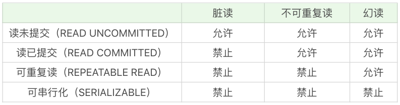

## 存储过程 Stored Procedure
存储过程是程序化的 SQL，可以直接操作底层数据表，相比于面向集合的操作方式，能够实现一些更复杂的数据处理。存储过程可以说是由 SQL 语句和流控制语句构成的语句集合，可以接收输入参数，也可以返回输出参数给调用者，返回计算结果。

```
CREATE PROCEDURE 存储过程名称([参数列表])
BEGIN
    需要执行的语句
END    
```

如果用的是 MySQL，你还需要用 DELIMITER 来临时定义新的结束符。因为默认情况下 SQL 采用（；）作为结束符，这样当存储过程中的每一句 SQL 结束之后，采用（；）作为结束符，就相当于告诉 SQL 可以执行这一句了。但是存储过程是一个整体，我们不希望 SQL 逐条执行，而是采用存储过程整段执行的方式，因此我们就需要临时定义新的 DELIMITER，新的结束符可以用（//）或者（$$）。

```
DELIMITER //
CREATE PROCEDURE `add_num`(IN n INT)
BEGIN
       DECLARE i INT;
       DECLARE sum INT;
       
       SET i = 1;
       SET sum = 0;
       WHILE i <= n DO
              SET sum = sum + i;
              SET i = i +1;
       END WHILE;
       SELECT sum;
END //
DELIMITER ;
```
### 存储过程的参数
* IN: 向存储过程传入的参数，不能被返回
* OUT: 把存储过程计算结果放入参数中，调用者可以得到返回值
* INOUT: 既可以向存储过程传入的参数，也可以把存储过程计算结果放入参数中

OUT示例
```
CREATE PROCEDURE `get_hero_scores`(
       OUT max_max_hp FLOAT,
       OUT min_max_mp FLOAT,
       OUT avg_max_attack FLOAT,  
       s VARCHAR(255)
       )
BEGIN
       SELECT MAX(hp_max), MIN(mp_max), AVG(attack_max) FROM heros WHERE role_main = s INTO max_max_hp, min_max_mp, avg_max_attack;
END
```
可以看到是使用INTO进行的赋值。

获取结果
```
CALL get_hero_scores(@max_max_hp, @min_max_mp, @avg_max_attack, '战士');
SELECT @max_max_hp, @min_max_mp, @avg_max_attack;
```

### 流控制语句
* BEGIN…END：BEGIN…END 中间包含了多个语句，每个语句都以（;）号为结束符。
* DECLARE：DECLARE 用来声明变量，使用的位置在于 BEGIN…END 语句中间，而且需要在其他语句使用之前进行变量的声明。
* SET：赋值语句，用于对变量进行赋值。
* SELECT…INTO：把从数据表中查询的结果存放到变量中，也就是为变量赋值。
* 1.IF…THEN…ENDIF：条件判断语句，我们还可以在 IF…THEN…ENDIF 中使用 ELSE 和 ELSEIF 来进行条件判断。
* CASE：CASE 语句用于多条件的分支判断
```
CASE 
  WHEN expression1 THEN ...
  WHEN expression2 THEN ...
  ...
    ELSE 
    --ELSE语句可以加，也可以不加。加的话代表的所有条件都不满足时采用的方式。
END
```
* WHILE…DO…END WHILE：这也是循环语句，和 REPEAT 循环不同的是，这个语句需要先进行条件判断，如果满足条件就进行循环，如果不满足条件就退出循环
。

### 存储过程优缺点
* 优点：首先存储过程可以一次编译多次使用。存储过程只在创造时进行编译，之后的使用都不需要重新编译，这就提升了 SQL 的执行效率。其次它可以减少开发工作量。将代码封装成模块，实际上是编程的核心思想之一，这样可以把复杂的问题拆解成不同的模块，然后模块之间可以重复使用，在减少开发工作量的同时，还能保证代码的结构清晰。还有一点，存储过程的安全性强，我们在设定存储过程的时候可以设置对用户的使用权限，这样就和视图一样具有较强的安全性。最后它可以减少网络传输量，因为代码封装到存储过程中，每次使用只需要调用存储过程即可，这样就减少了网络传输量。同时在进行相对复杂的数据库操作时，原本需要使用一条一条的 SQL 语句，可能要连接多次数据库才能完成的操作，现在变成了一次存储过程，只需要连接一次即可。

*缺点：调试困难，只有少数DBMS支持存储过程的调试。对于复杂的存储过程来说，开发和维护都不容易。

存储过程的版本管理也很困难，比如数据表索引发生变化了，可能会导致存储过程失效。我们在开发软件的时候往往需要进行版本管理，但是存储过程本身没有版本控制，版本迭代更新的时候很麻烦.

它不适合高并发的场景，高并发的场景需要减少数据库的压力，有时数据库会采用分库分表的方式，而且对可扩展性要求很高，在这种情况下，存储过程会变得难以维护，增加数据库的压力，显然就不适用了。

## transaction
进行一次处理的基本单元，要么完全执行，要么都不执行.MySQL 中，InnoDB 是支持事务的，而 MyISAM 存储引擎不支持事务。MySQL可以通过 SHOW ENGINES 命令来查看当前 MySQL 支持的存储引擎都有哪些，以及这些存储引擎是否支持事务。

### 事务的特性ACID

* A，也就是原子性（Atomicity）。原子的概念就是不可分割，你可以把它理解为组成物质的基本单位，也是我们进行数据处理操作的基本单位。
* C，就是一致性（Consistency）。一致性指的就是数据库在进行事务操作后，会由原来的一致状态，变成另一种一致的状态。也就是说当事务提交后，或者当事务发生回滚后，数据库的完整性约束不能被破坏。
* I，就是隔离性（Isolation）。它指的是每个事务都是彼此独立的，不会受到其他事务的执行影响。也就是说一个事务在提交之前，对其他事务都是不可见的。
* D，指的是持久性（Durability）。事务提交之后对数据的修改是持久性的，即使在系统出故障的情况下，比如系统崩溃或者存储介质发生故障，数据的修改依然是有效的。因为当事务完成，数据库的日志就会被更新，这时可以通过日志，让系统恢复到最后一次成功的更新状态。

ACID 可以说是事务的四大特性，在这四个特性中，原子性是基础，隔离性是手段，一致性是约束条件，而持久性是我们的目的。

常用控制语句
* START TRANSACTION 或者 BEGIN，作用是显式开启一个事务。
* COMMIT：提交事务。当提交事务后，对数据库的修改是永久性的。
* ROLLBACK 或者 ROLLBACK TO [SAVEPOINT]，意为回滚事务。意思是撤销正在进行的所有没有提交的修改，或者将事务回滚到某个保存点。
* SAVEPOINT：在事务中创建保存点，方便后续针对保存点进行回滚。一个事务中可以存在多个保存点。
* RELEASE SAVEPOINT：删除某个保存点。
* SET TRANSACTION，设置事务的隔离级别

使用事务有两种方式，分别为隐式事务和显式事务。隐式事务实际上就是自动提交，Oracle 默认不自动提交，需要手写 COMMIT 命令，而 MySQL 默认自动提交，当然我们可以配置 MySQL 的参数：
```
mysql> set autocommit =0; //关
mysql> set autocommit =1;  //开启自动提交
```

MYSQL completion_type 参数的作用，实际上这个参数有 3 种可能：
* completion=0，这是默认情况。也就是说当我们执行 COMMIT 的时候会提交事务，在执行下一个事务时，还需要我们使用 START TRANSACTION 或者 BEGIN 来开启。
* completion=1，这种情况下，当我们提交事务后，相当于执行了 COMMIT AND CHAIN，也就是开启一个链式事务，即当我们提交事务之后会开启一个相同隔离级别的事务（隔离级别会在下一节中进行介绍）。
* completion=2，这种情况下 COMMIT=COMMIT AND RELEASE，也就是当我们提交后，会自动与服务器断开连接。

当我们设置 autocommit=0 时，不论是否采用 START TRANSACTION 或者 BEGIN 的方式来开启事务，都需要用 COMMIT 进行提交，让事务生效，使用 ROLLBACK 对事务进行回滚。
当我们设置 autocommit=1 时，每条 SQL 语句都会自动进行提交。不过这时，如果你采用 START TRANSACTION 或者 BEGIN 的方式来显式地开启事务，那么这个事务只有在 COMMIT 时才会生效，在 ROLLBACK 时才会回滚。


## 事物隔离
* 脏读（Dirty Read）: 读到了其他事务还没有提交的数据。
* 不可重复读（Nnrepeatable Read）: 对某数据进行读取，发现两次读取的结果不同，也就是说没有读到相同的内容。这是因为有其他事务对这个数据同时进行了修改或删除。
* 幻读（Phantom Read）: 事务 A 根据条件查询得到了 N 条数据，但此时事务 B 更改或者增加了 M 条符合事务 A 查询条件的数据，这样当事务 A 再次进行查询的时候发现会有 N+M 条数据，产生了幻读。

不可重复读是**同一条记录**的内容被修改了，重点在于UPDATE或DELETE
幻读是查询某**一个范围**的数据行变多了或者少了，重点在于INSERT


解决异常数量从少到多的顺序（比如读未提交可能存在 3 种异常，可串行化则不会存在这些异常）决定了隔离级别的高低，这四种隔离级别从低到高分别是：读未提交（READ UNCOMMITTED ）、读已提交（READ COMMITTED）、可重复读（REPEATABLE READ）和可串行化（SERIALIZABLE）。这些隔离级别能解决的异常情况如下表所示：


* 读未提交，也就是允许读到未提交的数据，这种情况下查询是不会使用锁的，可能会产生脏读、不可重复读、幻读等情况。
* 读已提交就是只能读到已经提交的内容，可以避免脏读的产生，属于 RDBMS 中常见的默认隔离级别（比如说 Oracle 和 SQL Server），但如果想要避免不可重复读或者幻读，就需要我们在 SQL 查询的时候编写带加锁的 SQL 语句。
* 可重复读，保证一个事务在相同查询条件下两次查询得到的数据结果是一致的，可以避免不可重复读和脏读，但无法避免幻读。MySQL 默认的隔离级别就是可重复读。
* 可串行化，将事务进行串行化，也就是在一个队列中按照顺序执行，可串行化是最高级别的隔离等级，可以解决事务读取中所有可能出现的异常情况，但是它牺牲了系统的并发性。

```
#show isolation level
mysql> SHOW VARIABLES LIKE 'transaction_isolation';
# set isolation level
SET SESSION TRANSACTION ISOLATION LEVEL READ UNCOMMITTED;
```

隔离级别越低，意味着系统吞吐量（并发程度）越大，但同时也意味着出现异常问题的可能性会更大。在实际使用过程中我们往往需要在性能和正确性上进行权衡和取舍，没有完美的解决方案，只有适合与否。