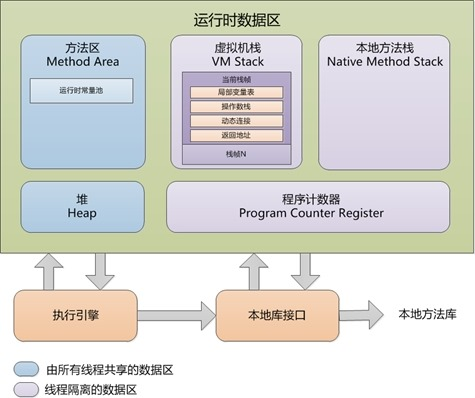
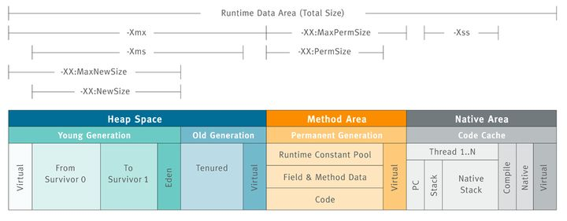

## JVM内存结构

[JAVA GC](https://www.bilibili.com/video/BV1dt411u7wi)

[JVM内存结构](https://www.bilibili.com/video/BV12t411u726)

[JVM内存结构和Java内存模型](https://zhuanlan.zhihu.com/p/38348646)




JVM的内存结构大概分为， 先来看看所有线程共享的二个区域, JVM 的优化问题主要在线程共享的数据区
* 堆(Heap): 所有线程共享。所有的对象实例以及数组都要在堆上分配。这个也是我们需要了解的重点， JAVA_OPTS 的主要配置，以及GC回收器主要都是针对它的。
* 方法区(Method Area, Java8叫元空间): 所有线程共享。存储类信息、常量、静态变量、即时编译器编译后的代码。注意JDK1.8之前存在的PermGen（永久代）， 方法区是 JVM 的规范，而PermGen则是 JVM 规范的一种实现，并且只有HotSpot才有 “PermGen space”。

再来看看线程私有的部分, 先来看看栈区，分为
* 虚拟机栈(JVM Stack): 线程私有。存储局部变量表、操作栈、动态链接、方法出口，对象指针。当栈调用深度大于JVM所允许的范围，会抛出StackOverflowError的错误。
* 本地方法栈(Native method stack): 线程私有。为虚拟机使用到的Native 方法服务。如Java使用c或者c++编写的接口服务时，代码在此区运行。一般不太需要关心

* 程序计数器（Program Counter Register）：线程私有。它可以看作是当前线程所执行的字节码的行号指示器。指向下一条要执行的指令。一般不太需要关心。

这张图充分说明了我们经常用到的JAVA_OPTS中参数的对应关系


### Heap 堆
Java 内存方面最需要理解的东西，堆的作用是存放对象实例和数组。从结构上来分，可以分为新生代和老年代, 也是GC操作的区域。
新生代又可以分为Eden 空间、From Survivor 空间（s0）、To Survivor 空间(s1)。Survivor的两个区是对称的，没先后关系。

* 新生代 GC： new的对象产生在Eden区，当Eden区快满的时候，就会触发GC，这个GC是在Young区的，所以也叫Young GC, Young GC采用的是复制算法，把在Eden区需要删除的打上一个标记，不需要删除的放在Survivor区（S0或者S1均可，内存大小 S0:S0:E区=1：1：8）。为什么要2块Survivor区？因为这个S区是交替工作的，在E区打完标记后，不需要删除的被放到S0区，然后把E区+S1区一起删除，等下一次满的时候，将不需要删除的被放到S1区，然后把E区+S0区一起删除

* 老生带 GC：在每一次的Young GC的时候，它的年龄都会加1，直到年龄到达了15岁（7是初始值，岁数是个动态变化的值，在每次gc的时候都会重新计算，它就不在Survivor区里面进行复制了，而是直接将不需要删除的对象放到Old区里面，因为之前的Young GC都没去掉，说明可能要过很久才能去掉；除了存了年龄大于等于15岁的，还存了大的对象（如：1个1千万大小的int数组），Old区满的时候也会触发GC，Old GC一般也会伴随着Young GC, 所以也叫做Full GC, 这会引起Stop-The-World,整个Java程序直接暂停，来全力的进行垃圾回收，

#### 控制参数
必须设置的参数：
```
-Xms: 初始Heap大小，使用的最小内存。
-Xmx： 设置堆的最大空间大小。
```

```
-Xmn: JDK 1.4 or lator,年轻代大小,不确认可以不用配置。
-XX:NewSize: JDK 1.3/1.4 , 设置年轻代大小 
```

异常情况
如果在堆中没有内存完成实例分配，并且堆也无法再扩展时，将会抛出OutOfMemoryError 异常


### 方法区
方法区（Method Area）与Java 堆一样，是各个线程共享的内存区域，它用于存储已被虚拟机加载的类信息、常量、静态变量、即时编译器编译后的代码等数据。虽然Java 虚拟机规范把方法区描述为堆的一个逻辑部分，但是它却有一个别名叫做Non-Heap（非堆），目的应该是与Java 堆区分开来。

注意JDK1.8之前存在的PermGen（永久代 Permanent Generation）， 方法区是 JVM 的规范，而PermGen则是 JVM 规范的一种实现，并且只有HotSpot才有 “PermGen space”。在Java8中永生代彻底消失了。


控制参数
```
JDK 1.8后 PermSize 和 MaxPermGen 已经无效。
-XX:PermSize 设置最小空间
-XX:MaxPermSize 设置最大空间。
JDK 1.8后 参数
-XX:MetaspaceSize=128M 元空间默认大小
-XX:MaxMetaspaceSize=128m 元空间最大大小
```

垃圾回收
对此区域会涉及但是很少进行垃圾回收。这个区域的内存回收目标主要是针对常量池的回收和对类型的卸载，一般来说这个区域的回收“成绩”比较难以令人满意。

异常情况
根据Java 虚拟机规范的规定，当方法区无法满足内存分配需求时，将抛出OutOfMemoryError。


### JVM Stack 虚拟机栈
每个线程会有一个私有的栈。每个线程中方法的调用又会在本栈中创建一个栈帧。在方法栈中会存放编译期可知的各种基本数据类型（boolean、byte、char、short、int、float、long、double）、对象引用（reference 类型，它不等同于对象本身。局部变量表所需的内存空间在编译期间完成分配，当进入一个方法时，这个方法需要在帧中分配多大的局部变量空间是完全确定的，在方法运行期间不会改变局部变量表的大小。

控制参数
-Xss: 控制每个线程栈的大小。


异常情况
在Java 虚拟机规范中，对这个区域规定了两种异常状况：
```
- StackOverflowError： 异常线程请求的栈深度大于虚拟机所允许的深度时抛出；
- OutOfMemoryError 异常： 虚拟机栈可以动态扩展，当扩展时无法申请到足够的内存时会抛出。
```

