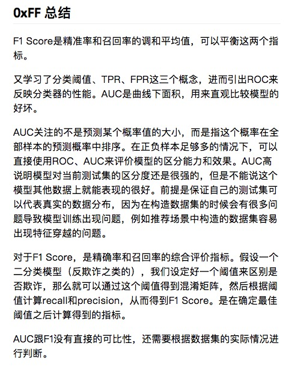

# 如何评价模型的好坏
WW2的学习内容
[数据科学家学习小组第二周](https://mp.weixin.qq.com/s/iNLU2oRrqO7QeQuvNJOxvA)

* 数据拆分：训练数据集&测试数据集

* 评价分类结果：精准度、混淆矩阵、精准率、召回率、F1 Score、ROC曲线等

* 评价回归结果：MSE、RMSE、MAE、R Squared


[机器学习的敲门砖：kNN算法  - 中](https://mp.weixin.qq.com/s/vvCM0vWH5kmRfrRWxqXT8Q)

[评价分类结果（上）](https://mp.weixin.qq.com/s/Fi13jaEkM5EGjmS7Mm_Bjw)

[模型之母：线性回归的评价指标 ](https://mp.weixin.qq.com/s?__biz=MzI4MjkzNTUxMw==&mid=2247483749&idx=1&sn=0383d2b98ff1b8e4f38e7e96ced3918a&scene=21#wechat_redirect)

## 训练数据集 & 测试数据集
在监督学习中，我们为了验证模型的效果，一般会对数据进行拆分，分为训练数据集和测试训练集。使用训练数据集训练模型后，再用测试数据集评估模型的训练结果， 这个过程可能需要进行多次迭代，找到最合适的模型。

[仿照sklearn实现自己的train_test_split](https://github.com/hbian/tec_blog/blob/master/ml/fundamental/study_group/ww1_knn/knn_sk_like.py)


## 分类准确度accuracy
accuracy_score：函数计算分类准确率，返回被正确分类的样本比例（default）或者是数量（normalize=False）

[手动实现简单的sklearn accuracy_score 方法](https://github.com/hbian/tec_blog/blob/master/ml/fundamental/study_group/ww2_evaluation/accuracy.py)

## 超参数
超参数是指在机器学习模型初始化时候需要指定的参数，调参就是调的这个参数。
与之对应的是模型参数，算法过程中学到的属于这个模型的参数。

* 以KNN为例，K就是一个超参数，
以KNN中的k为例，循环更新k的值，可以找到最好的score

* 另一个超参数：权重
在knn中我们并没有考虑样本节点到测试节点的距离， 但我们可以认为距离测试节点最近的样本对其影响更大，权重更大。
在sklearn 的KNeighborsClassifier，weights这个参数，默认是uniform即不考虑距离，也可以写distance来考虑距离权重(默认是欧拉距离，如果要是曼哈顿距离，则可以写参数p（明可夫斯基距离的参数） 


## 超参数网格搜索
在具体的超参数搜索过程中会需要很多问题，超参数过多、超参数之间相互依赖等等。如何一次性地把我们想要得到最好的超参数组合列出来。sklearn中专门封装了一个超参数网格搜索方法Grid Serach。

在进行网格搜索之前，首先需要定义一个搜索的参数param_search。是一个数组，数组中的每个元素是个字典，字典中的是对应的一组网格搜索，每一组网格搜索是这一组网格搜索每个参数的取值范围。键是参数的名称，值是键所对应的参数的列表。
可以看到，当weights = uniform即不使用距离时，我们只搜索超参数k，当weights = distance即使用距离时，需要看超参数p使用那个距离公式。
[GridSearchCV方法调用示例](https://github.com/hbian/tec_blog/blob/master/ml/fundamental/study_group/ww2_evaluation/sklearn_gridsearch.py)

运行结果如下：
```
#dataset shape
(112, 4)
before grid search:0.9736842105263158
#grid_search.best_params_
{'n_neighbors': 9, 'p': 3, 'weights': 'distance'}
#grid_search.best_score_
0.9732142857142857
#knn_clf = grid_search.beat_estimator_
KNeighborsClassifier(algorithm='auto', leaf_size=30, metric='minkowski',
           metric_params=None, n_jobs=1, n_neighbors=9, p=3,
           weights='distance')
After grid search:1.0
```
从代码结果可以看到，网格搜索前后score有明显的提升

best_estimator_和best_score_参数后面有一个_。这是一种常见的语法规范，不是用户传入的参数，而是根据用户传入的规则，自己计算出来的结果，参数名字后面接_

这里测试中还遇到另外一个问题，使用iris数据集，  grid_search.fit(X_train, y_train)这一步在搜索参数时只需要677ms， 但是当使用digits数字这个数据集时，花了4min36s.

可以看到这个方法适合于小数据集，一旦数据的量级上去了，很难得出结果。


## 混淆矩阵(Confusion Matrix)
分类的准确度在数据极度偏斜(Skewed Data)的时候是无法准确衡量结果的，
对于一个癌症预测系统，输入检查指标，判断是否患有癌症，预测准确度99.9%。这个系统是好是坏呢？如果癌症产生的概率是0.1%，那其实根本不需要任何机器学习算法，只要系统预测所有人都是健康的，即可达到99.9%的准确率。
另外一个现在处理的爬虫检测的时候也遇到类似问题，网站访问的大多数都是爬虫的时候，用accuracy无法准确衡量模型的好坏，这时候需要用混淆矩阵。

对于二分类问题来说，所有的问题被分为0和1两类，混淆矩阵是2*2的矩阵：
预测值0    预测值1

真实值0    TN  FP

真实值1    FN  TP

* TN：真实值是0，预测值也是0，即我们预测是negative，预测正确了。
* FP：真实值是0，预测值是1，即我们预测是positive，但是预测错误了。
* FN：真实值是1，预测值是0，即我们预测是negative，但预测错误了。
* TP：真实值是1，预测值是1，即我们预测是positive，预测正确了。


* 准确率(accuracy)
ACC = (TP + FP) / (TP + FP + TN + FN) 准确率的问题， 在数据极度不平衡的情况下，类别1的数据太少，那么完全错分类别1的情况下我们仍然可以达到很高的准确度， 但我们希望关注的类别1却被忽视了，比如说网站访问的真实用户点击率，可能只有1%，那么即使完全预测错误这一块，acc仍然能到99%。


* 精准率(Precision)
P = TP / (TP + FP) 分母为所有预测为1的个数，分子是其中预测对了的个数，即预测值为1，且预测对了的比例.

* Precision是因为在数据有倾斜的情况时，我们更关注标注值为1的情况**
精准率为我们关注的那个事件，预测的有多准.比如在预计患病，我们选择的分母是所有预测结果为患病的，分子为实际结果也是患病的.

* 召回率(Recall)
Recall = TP / (TP + FN) 所有真实值为1的数据中，预测对了的个数.
我们所关注的事情真实发生时，我们预测正确的比例。

这里可以看到精准率和召回率都是基于我们需要预测或者关注的事件1，所以这个时候能很好的处理0比较多，数据倾斜的问题。

**精准率(查准率)：预测值为1， 而且预测对的比例**
**召回率(查全率): 所有真实值为1，预测对了的个数**
二者的区别在于一个关注预测值为1，另一个关注真实值为1

对于一个算法模型，我们需要在精准率高一些，召回率低一些或反之的情况做选择的时候，这个应该看算法的实用场景而定。
需要关注查准率的例子：比如股票预测系统，系统预测会上涨的股票中，实际上涨的越多越好， 那么我们希望查准率更高。对于查全率， 我们没有预料到某些股票会上涨，那么我们没有投资，其实也没有损失，但是查准率里面的股票，我们是投资了的，所以如果查准率不高的话，我们会有实际的损失。
cd /mntcd
需要关注召回率的例子：在医疗领域做疾病诊断，如果召回率低，意味着本来有一个病人得病了，但是没有正确预测出来，病情就恶化了。我们希望尽可能地将所有有病的患者都预测出来，而不是在看在预测有病的样例中有多准。

## F1 score
同时需要关注精准率和召回率时， 我们可以考虑用
F1 = 2Precision*Recall / (Precision + Recall)
调和平均值的特点是如果二者极度不平衡，如某一个值特别高、另一个值特别低时，得到的F1 Score值也特别低；只有二者都非常高，F1才会高。 **因此在数据有偏的情况下，F1  Score的指标更好。**


## 分类阈值
分类阈值，即设置判断样本为正例的阈值threshold
精准率和召回率这两个指标有内在的联系，并且相互冲突。precision随着threshold的增加而增加，recall随着threshold的增大而减小。如果某些场景需要precision，recall都保持在80%，可以通过这种方式求出threshold
在sklearn中有一个方法叫：decision_function，即返回分类阈值
```
decision_scores = log_reg.decision_function(X_test)
```

## TPR FPR ROC AUC
* TPR：预测为1，且预测对了的数量，占真实值为1的数据百分比， 其实就是召回率。
TPR = TP/TP+FN
* FPR: 预测为1，但预测错了的数量，占真实值不为1的数据百分比。
 FPR = FP/FP+TN

TPR就是所有正例中，有多少被正确地判定为正；FPR是所有负例中，有多少被错误地判定为正。

TPR和FPR之间是成正比的，TPR高，FPR也高。ROC曲线就是刻画这两个指标之间的关系。
ROC就是描述二者关系的曲线，x轴是FPR，y轴是TPR。

在分类器的效果判断时，ROC曲线距离左上角越近，证明分类器效果越好。如果一条算法1的ROC曲线完全包含算法2，则可以断定性能算法1>算法2。

很多时候两个分类器的ROC曲线交叉，无法判断哪个分类器性能更好，这时可以计算曲线下的面积AUC，作为性能度量。
一般在ROC曲线中，我们关注是曲线下面的面积， 称为AUC（Area Under Curve）。这个AUC是横轴范围（0,1 ），纵轴是（0,1）所以总面积是小于1的。*
* AUC = 1，是完美分类器，采用这个预测模型时，不管设定什么阈值都能得出完美预测。绝大多数预测的场合，不存在完美分类器。
* 0.5 < AUC < 1，优于随机猜测。这个分类器（模型）妥善设定阈值的话，能有预测价值。
* AUC = 0.5，跟随机猜测一样，模型没有预测价值。
* AUC < 0.5，比随机猜测还差；但只要总是反预测而行，就优于随机猜测。


# 分类模型的算法评价总结

*首先可以看准确度，但准确度(score)针对数据倾斜的情况无法准确衡量模型的好坏。
*针对数据倾斜的情况：我们首先需要针对模型所面对的场景判断(了解业务的重要性！！)，是精准率和召回率哪个指标更重要.
*如果无法判断或者需要兼顾精准率和召回率， 那么可以考虑使用F1 SCORE
*还有就是可以根据ROC曲线的面积AOC进行评价

F1 SCORE VS AUC: 这个仍需要进一步的理解
https://stackoverflow.com/questions/34698161/how-to-interpret-almost-perfect-accuracy-and-auc-roc-but-zero-f1-score-precisio#34698935




## 回归模型的评价

## 线性回归的评价指标
简单线性回归的目标是对于训练数据集合来说，使  
$$\sum_{i=1}^m {(Ytrain_i - ytrain_i)^2}$$ 尽可能小

在得到a和b之后将. 可以使用测试集衡量回归算法好坏的标准 
$$\sum_{i=1}^m {(Ytest_i - ytest_i)^2}$$。

### 均方误差MSE
将以上的求和结果再除以m，获得平均值就可以消除数据量带来的差别
Mean Squared Error

$$\frac{1}\{m}\sum_{i=1}^m {(Ytest_i - ytest_i)^2}$$

### 均方根误差RMSE
但是使用均方误差MSE收到量纲的影响，可以将其开方（为了解决方差的量纲问题，将其开方得到平方差）得到均方根误差RMSE（Root Mean Squarde Error）
$$\sqrt{\frac{1}\{m}\sum_{i=1}^m {(Ytest_i - ytest_i)^2}} $$

### 平均绝对误差MAE
对于线性回归算法还有另外一种非常朴素评测标准。要求真实值  与 预测结果  之间的距离最小，可以直接相减做绝对值，加m次再除以m，即可求出平均距离，被称作平均绝对误差MAE（Mean Absolute Error）

### R square
[最好的评价线性回归的指标-R Squared](https://blog.csdn.net/huobumingbai1234/article/details/81041699)

RMSE这样的算法无法进行不同量纲之间的比较，比如比较一个衡量房价的的方差金额一个预测身高的方差。这时候我们需要将这些指标放在[0,1]的相同区间内才更好比较，公式直接在网上搜索。

* 分子： 我们的模型预测产生的错误，
* 分母： 不考虑x的取值，只是很生硬的将所有的预测样本的预测结果都认为是样本y的均值，使用这个模型所产生的错误. 可以理解为一个预测模型，只是该模型与x无关，在机器学习领域称这种模型为基准模型（Baseline Model），适用于所有的线型回归算法

得到如下结论
* R^2 <= 1
* R2越大也好，越大说明减数的分子小，错误率低, 我们的模型越好. 当我们预测模型不犯任何错误时，R2最大值1
* 如果R^2 < 0，说明我们学习到的模型还不如基准模型。此时，很有可能我们的数据不存在任何线性关系。