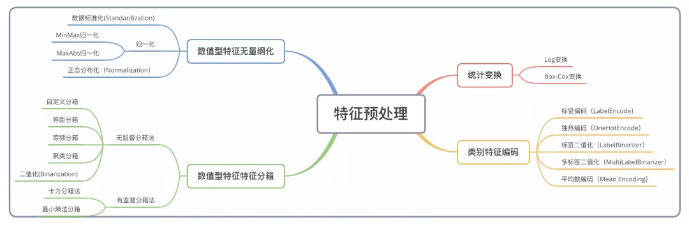

# 数据预处理和特征工程
WW3的学习内容:
* 无量纲化：最值归一化、均值方差归一化及sklearn中的Scaler
* 缺失值处理
* 处理分类型特征：编码与哑变量
* 处理连续型特征：二值化与分段

相关文章链接:
[归一化与KD树](https://mp.weixin.qq.com/s?__biz=MzI4MjkzNTUxMw==&mid=2247483857&idx=3&sn=5a4573e5fe074241a45f6affb969448f&chksm=eb932867dce4a171ff2890ee6b326cfc234e1361948d673c30ea30110894435a63f780b0540e&token=932563280&lang=zh_CN&scene=21#wechat_redirect)

[特征工程系列：特征预处理上](https://mp.weixin.qq.com/s?__biz=MzUyMjI4MzE0MQ==&mid=2247484542&idx=1&sn=0d5c0142b361d9a45726699c385bfdc3&scene=21#wechat_redirect)

[sklearn中的数据预处理和特征工程](https://www.cnblogs.com/juanjiang/archive/2019/05/30/10948849.html)



## 数值型特征无量纲化
无量纲化并不是把m变成cm，而是无论m, cm都统一变为1，无单位。
无量纲化的原因：
* 归一化有可能提高精度，数据量级的差异会导致量级较大的属性占据主导地位， 这样可能于实际情况不相符。
* 数据量级的差异将会导致，当使用梯度下降法寻求最优解时，很有可能走“之字型”路线（垂直等高线走），从而导致需要迭代很多次才能收敛；
* 依赖于样本距离的算法对于数据的数量级非常敏感。

一个特例是决策树和树的集成算法们，对决策树我们不需要无量纲化，决策树可以把任意数据都处理得很好。

有以下几种方法进行无量纲化处理：
* 数据标准化(standardization)，
* 正太分布化(normalization)
* 归一化：MinMax归一化, MaxAbs归一化


### 数据标准化(standardization)
标准化的前提是特征值服从正态分布，标准化后，其转换成标准正态分布。
把所有数据归一到均值为0方差为1的分布中。适用于数据中没有明显的边界,有可能存在极端数据值的情况,可以看到这里的取值并不是0,1之间的，会有负值.
Xscale = x- xmean/S
所以这种方法又可以称为均值方差归一化。
在具体应用时，在对测试数据进行归一化计算时，应当选用训练数据集的train_mean和train_std, 因为测试数据是模拟的真实的数据，真实环境可能无法获得均值和方差，而且如果测试数据集太小，不完整，可能存在较大的数据偏差， 那么做归一化时应当使用
(xtest-train_mean)/train_std
以下是以sklearn为例
```
from sklearn import datasets
from sklearn.model_selection import train_test_split
iris = datasets.load_iris(）

X_train,X_test,y_train,y_test = train_test_split(iris.data,iris.target,test_size=0.2,random_state=666)
from sklearn.preprocessing import StandardScaler
standardScaler = StandardScaler()
#
standardScaler.fit(X_train)

X_train_standard = standardScaler.transform(X_train)
X_test_standard = standardScaler.transform(X_test)
print("X_train_standard: {}".format(X_train_standard))
print("X_test_standard: {}".format(X_test_standard))
```
可以看到transform的过程，类似模型训练，首先初始化实例，然后调用fit方法， 其实fit方法很简单，就是计算均值和方差, 那么后面对测试数据进行归一化时，会使用这一步获取的均值和方差。
```
   def fit(self, X):
        """根据训练数据集X获得数据的均值和方差"""
        assert X.ndim == 2, "The dimension of X must be 2"

        # 求出每个列的均值
        self.mean_ = np.array([np.mean(X[:,i] for i in range(X.shape[1]))])
        self.scale_ = np.array([np.std(X[:, i] for i in range(X.shape[1]))])

        return self
```

实际Sklearn的调用代码仅需要
```
from sklearn.preprocessing import StandardScaler
#标准化，返回值为标准化后的数据
standardScaler  = StandardScaler().fit(X_train)
standardScaler.transform(X_train)
```

### 数据归一化
常用的归一化方法：
### MinMax归一化(normalization)：把所有数据映射到0-1之间。最值归一化的使用范围是特征的分布具有明显边界(分数0-100， 灰度0-255)
Xscale = x- xmin/xmax-xmin

```
from sklearn.preprocessing import MinMaxScaler
#区间缩放，返回值为缩放到[0, 1]区间的数据
minMaxScaler  = MinMaxScaler().fit(X_train)
minMaxScaler.transform(X_train)
```
可以看到transform的过程，类似模型训练，首先初始化实例，然后调用fit方法，再transform

缺点：
* 有新数据加入时，可能导致max和min的变化，需要重新定义
* MinMaxScaler对异常值的存在非常敏感。


### MaxAbs归一化
Xscale = x/|xmax|, 数据映射到[-1, 1]之间, 这个方法的优点是不会移动或者居中任何数据, 因此不会破坏稀疏性。
```
from sklearn.preprocessing import MaxAbsScaler
maxAbsScaler  = MaxAbsScaler().fit(X_train)
maxAbsScaler.transform(X_train)
```
缺点：
* 有新数据加入时，可能导致max的变化，需要重新定义
* 离群值异常值的影响较大

### 正态分布化（Normalization）
正则化的过程是将每个样本缩放到单位范数(每个样本的范数为1)，如果要使用如二次型(点积)或者其它核方法计算两个样本之间的相似性这个方法会很有用。
该方法是文本分类和聚类分析中经常使用的向量空间模型（Vector Space Model)的基础。
Sklearn代码如下
```
from sklearn.preprocessing import Normalizer
normalizer  = Normalizer(norm='l2').fit(X_train)
normalizer.transform(X_train)
```

### 标准化VS归一化
这二种方法都是为了消除数据中因量纲不同引起的误差，都是一种线性变换，都是对向量进行按比例压缩后进行平移。

不同点:
* 目的不一样：归一化会将数据压缩到固定的区间[0, 1], [-1,1], 但是标准化只是调整数据特征的整体分布。
* 归一化与最大，最小值有关. 标准化与均值，标准差有关

使用范围:
* 如果数据较为稳定，不存在极端的最大最小值，用归一化；
* 如果对输出结果范围有要求，用归一化；
* 如果数据存在异常值和较多噪音，用标准化，可以间接通过中心化避免异常值和极端值的影响。

归一化与标准化的应用场景
* 在分类、聚类算法中，需要使用距离来度量相似性的时候（如SVM、KNN）、或者使用PCA技术进行降维的时候，标准化(Z-score standardization)表现更好；

* 在不涉及距离度量、协方差计算、数据不符合正太分布的时候，可以使用第一种方法或其他归一化方法。比如图像处理中，将RGB图像转换为灰度图像后将其值限定在[0 255]的范围；

* 基于树的方法不需要进行特征的归一化。例如随机森林，bagging与boosting等方法。
如果是基于参数的模型或者基于距离的模型，因为需要对参数或者距离进行计算，都需要进行归一化。

**一般来说，建议优先使用标准化。对于输出有要求时再尝试别的方法，如归一化或者更加复杂的方法。很多方法都可以将输出范围调整到[0, 1]，如果我们对于数据的分布有假设的话，更加有效的方法是使用相对应的概率密度函数来转换**

大多数机器学习算法中，会选择StandardScaler来进行特征缩放，因为MinMaxScaler对异常值非常敏感。在PCA，聚类，逻辑回归，支持向量机，神经网络这些算法中，StandardScaler往往是最好的选择。MinMaxScaler在不涉及距离度量、梯度、协方差计算以及数据需要被压缩到特定区间时使用广泛，比如数字图像处理中量化像素强度时，都会使用MinMaxScaler将数据压缩于[0,1]区间之中。


## 数值型特征的分箱处理

数值型特征的分箱处理其实就是对数据进行离散化处理，将数据由数值型数据转化为类别型数据。

分箱处理的原因和优点：

* 离散化后对异常数据的处理有更强的鲁棒性，比如一个年龄特征>30 为1，否则为0，一个异常年龄为300的就会对没有进行离散化处理的特征造成很大的干扰。
* 特征离散化后，模型会更稳定， 比如20-30这个区间，不会因为年龄增加一岁，完全变为另外一个人。
* 可以将缺失作为独立的一类带入模型

### 无监督分箱
* 自定义分箱: 是指根据业务经验或者常识等自行设定划分的区间，然后将原始数据归类到各个区间中。

* 等距分箱: 按照相同宽度将数据分成几等份，从最小值到最大值之间,均分为 N 等份, 这样, 如果 A,B 为最小最大值, 则每个区间的长度为 W=(B−A)/N , 则区间边界值为A+W,A+2W,….A+(N−1)W。这里只考虑边界，每个等份里面的实例数量可能不等。缺点是受到异常值的影响比较大

* 等频分箱: 将数据分成几等份，每等份数据里面的个数是一样的。

* 聚类分箱
基于k均值聚类的分箱：k均值聚类法将观测值聚为k类，但在聚类过程中需要保证分箱的有序性.
 实现步骤
Step 0：对预处理后的数据进行归一化处理；

Step 1：将归一化处理过的数据，应用k-means聚类算法，划分为多个区间：

采用等距法设定k-means聚类算法的初始中心，得到聚类中心；

Step 2：在得到聚类中心后将相邻的聚类中心的中点作为分类的划分点，将各个对象加入到距离最近的类中，从而将数据划分为多个区间；

Step 3：重新计算每个聚类中心，然后重新划分数据，直到每个聚类中心不再变化，得到最终的聚类结果。

* 二值化: 二值化可以将数值型（numerical）的feature进行阀值化得到boolean型数据。定量特征二值化的核心在于设定一个阈值，大于阈值的赋值为1，小于等于阈值的赋值为0.

## 有监督分箱法
卡方分箱法 和 最小熵法分箱，这个不是太明白，需要今后进一步回看。


## 缺失值的填补
sklearn中的方法
```
class sklearn.impute.SimpleImputer(missing_values=nan, strategy=’mean’, fill_value=None, verbose=0, copy=True)

missing_values:数据中的缺失值长什么样，默认空值np.nan
strategy: mean, median, most_frequent, constant
fill_value: strategy为constant时，填写的固定值
copy：默认为True，将创建特征矩阵的副本，反之则会将缺失值填补到原本的特征矩阵中去。
```


也可以直接调用pandas方法
```
​data.loc[:,"Age"] = data.loc[:,"Age"].fillna(data.loc[:,"Age"].median())
#.fillna 在DataFrame里面直接进行填补
​
data.dropna(axis=0,inplace=True)
#.dropna(axis=0)删除所有有缺失值的行，.dropna(axis=1)删除所有有缺失值的列
#参数inplace，为True表示在原数据集上进行修改，为False表示生成一个复制对象，不修改原数据，默认False
```


## 数据编码
数据编码: 将文字型数据转换为数值型。
* preprocessing.LabelEncoder：标签专用，能够将分类转换为分类数值
```
from sklearn.preprocessing import LabelEncoder
​
y = data.iloc[:,-1]                         #要输入的是标签，不是特征矩阵，所以允许一维
​
le = LabelEncoder()                         #实例化
le = le.fit(y)                              #导入数据
label = le.transform(y)                     #transform接口调取结果
​
le.classes_                                 #属性.classes_查看标签中究竟有多少类别
label                                       #查看获取的结果label
​
le.fit_transform(y)                         #也可以直接fit_transform一步到位
​
data.iloc[:,-1] = label                     #让标签等于我们运行出来的结果
​
data.head()
​
#如果不需要教学展示的话我会这么写：
from sklearn.preprocessing import LabelEncoder
data.iloc[:,-1] = LabelEncoder().fit_transform(data.iloc[:,-1])
```

针对比如体重，0-40,40-70， 70-100特征，学历特征，性别特征，飞机仓位特征.在对特征进行编码的时候，这三种分类数据都会被我们转换为[0,1,2]，这三个数字在算法看来，是连续且可以计算的，这三个数字相互不等，有大小，并且有着可以相加相乘的联系。所以算法会把舱门，学历这样的分类特征，都误会成是体重这样的分类特征。这是说，我们把分类转换成数字的时候，忽略了数字中自带的数学性质，所以给算法传达了一些不准确的信息，而这会影响我们的建模。

OrdinalEncoder可以用来处理有序变量，但对于名义变量，我们只有使用哑变量的方式来处理，才能够尽量向算法传达最准确的信息：
例如ABC舱, 编码为如下矩阵而不是[0,1,2]
```
"A": [1,0,0],
"B": [0,1,0],
"C": [0,0,1],
```

这样的变化，让算法能够彻底领悟，原来三个取值是没有可计算性质的，是“有你就没有我”的不等概念。在我们的数据中，性别和舱门，都是这样的名义变量。因此我们需要使用独热编码，将两个特征都转换为哑变量。

* preprocessing.OrdinalEncoder：特征专用，能够将分类特征转换为分类数值
OrdinalEncoder可以用来处理有序变量。
```
from sklearn.preprocessing import OrdinalEncoder
​
#接口categories_对应LabelEncoder的接口classes_，一模一样的功能
data_ = data.copy()
​
data_.head()
​
OrdinalEncoder().fit(data_.iloc[:,1:-1]).categories_
​
data_.iloc[:,1:-1] = OrdinalEncoder().fit_transform(data_.iloc[:,1:-1])
​
data_.head()
```

* preprocessing.OneHotEncoder：独热编码，创建哑变量
```
data.head()
​
from sklearn.preprocessing import OneHotEncoder
X = data.iloc[:,1:-1]
​
enc = OneHotEncoder(categories='auto').fit(X)
result = enc.transform(X).toarray()
result
​
#依然可以直接一步到位，但为了给大家展示模型属性，所以还是写成了三步
OneHotEncoder(categories='auto').fit_transform(X).toarray()
​
#依然可以还原
pd.DataFrame(enc.inverse_transform(result))
​
enc.get_feature_names()
​
result
result.shape
​
```


